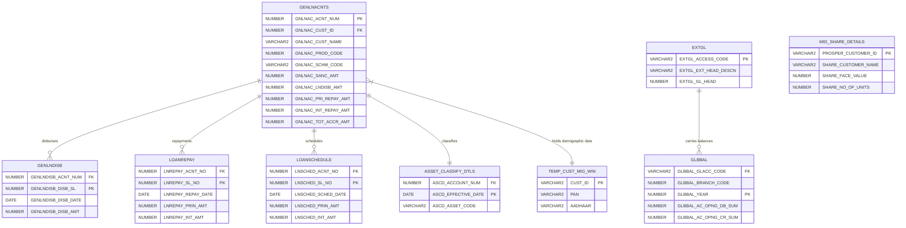

# DNBS-02 Regulatory Reporting Integration Plan & Data Model Mapping

This document provides a comprehensive blueprint for connecting to the legacy Oracle database, mapping the core schemas, and programmatically generating the RBI **DNBS-02 (Important Financial Parameters)** Excel report in the Moneypal application.

---

## 1. Executive Summary: DNBS-02 Report Overview
The RBI DNBS-02 return requires NBFCs to report critical asset quality, investment, and organizational parameters. The provided Excel file [DNBS02-Important Financial Parameters (1) (4) (2).xlsx](file:///home/null/Projects/moneypal/docs/DNBS02-Important%20Financial%20Parameters%20(1)%20(4)%20(2).xlsx) contains **28 sheets in total** representing these return categories:

* **Administrative Sheets (2):** General filing metadata and authorized signatory details.
* **Part-Level Aggregates (13):** Dynamic tables summarizing sources/applications of funds, capital adequacy, sensitive sector exposure, and credit quality breakdowns.
* **Detailed Disclosures (13 Annexures):** Transaction and counterparty-level breakdowns of borrowings, investments, board of directors, shareholdings, top 25 borrowers, top 25 investments, top 25 NPAs, and branch operations.

---

## 2. Oracle Database Connection Configuration
We have verified connection credentials and schema locations. The live Oracle database contains the full production snapshot of the core lending system.

### Connection Parameters
* **Host:** `192.168.1.183`
* **Port:** `1521`
* **Service Name:** `FREEPDB1`
* **User (Unlocked):** `moneypal`
* **Password:** `MyPass123`
* **Active Production Schema:** `GICCPROD_NEW`

### Connection Protocol (Python thin mode)
```python
import oracledb

# Initialize connection in thin mode (requires no Oracle instant client libraries)
dsn = "192.168.1.183:1521/FREEPDB1"
conn = oracledb.connect(user="moneypal", password="MyPass123", dsn=dsn)
```

---

## 3. Data Model ER Diagram (Oracle Database Only)

Below is the entity-relationship (ER) diagram representing the database structure of the Oracle tables and their keys, mapped for this report:



---

## 4. Data Model Table Directory (Oracle Database)

Here is a clean directory of the specific tables in the `GICCPROD_NEW` schema that are used to fetch the parameters for all 28 sheets of the report.

| Table Name | Primary Key / Joins | Purpose | Row Count |
|---|---|---|---|
| **1. `GENLNACNTS`** | `GNLNAC_ACNT_NUM` | Master Loan registry containing customer details, sanctioned limits, and product codes (Gold, Microfinance, MSME). | 13,510 |
| **2. `GENLNDISB`** | `GENLNDISB_ACNT_NUM` (FK) | Disbursement records containing disbursement dates and amounts. | 5,481 |
| **3. `LOANREPAY`** | `LNREPAY_ACNT_NO` (FK) | Repayment transactions recording actual principal and interest received. | 13,483 |
| **4. `LOANSCHEDULE`** | `LNSCHED_ACNT_NO` (FK) | Amortization schedules recording due dates and planned principal/interest splits. | 260,437 |
| **5. `ASSET_CLASSIFY_DTLS`** | `ASCD_ACCOUNT_NUM` (FK) | Delinquency asset classification master (Standard, SMA0, SMA1, SMA2, NPA). | 6,833 |
| **6. `EXTGL`** | `EXTGL_ACCESS_CODE` | External General Ledger head catalog containing descriptive account names (e.g. `CANARA STEEL LTD`). | 723 |
| **7. `GLBBAL`** | `GLBBAL_GLACC_CODE` (FK) | General Ledger balances by branch and financial year, containing opening and closing sums. | 1,221 |
| **8. `TEMP_CUST_MIG_WIN`** | `CUST_ID` (joins GNLNAC_CUST_ID)| Customer demographic staging table containing PANs and Aadhaar numbers. | 100+ |
| **9. `MIG_SHARE_DETAILS`** | `PROSPER_CUSTOMER_ID` | Shareholder ledger recording face values, share units, and shareholder names. | 4,079 |

---

## 5. Sheet-by-Sheet Data Mapping (Oracle Tables Only)

| Sheet Name | Source Oracle Table(s) | Mapping Logic & Primary Fields |
|---|---|---|
| **FilingInfo** | *Static* | Configured metadata (Return code `R039`, scale `LAKHS`). |
| **AuthorisedSignatory** | *Static* | Configured metadata (MANAGER credentials). |
| **DNBS02_PART1** | `GLBBAL` / `EXTGL` | Capital account balances (capital shares, reserves) from GL balance heads. |
| **DNBS02_PART2** | `GENLNACNTS` / `LOANSCHEDULE`| Summarizes total loans, secured/unsecured split, and receivables buckets (within 3m, 3-12m, >12m). |
| **DNBS02_PART3** | `GLBBAL` / `EXTGL` | Fund-based income, fees, and operational expenses from revenue GL heads. |
| **DNBS02_PART4** | `GLBBAL` / `EXTGL` | Net Owned Funds calculation based on PART1 equity heads. |
| **DNBS02_PART5** | `GLBBAL` | Risk-weighted off-balance sheet exposures (treasury liability heads). |
| **DNBS02_PART6** | `GENLNACNTS` | Exposure to sensitive sectors (grouped by security scheme codes). |
| **DNBS02_PART7 / 7A** | `GLBBAL` / `EXTGL` | Group/associate exposures (ICDs, loans, equity investments under group parents). |
| **DNBS02_PART8** | `GENLNACNTS` | Sectoral credit counts and balances (Agriculture, Industry, Services). |
| **DNBS02_PART8A** | `GENLNACNTS` | MSME exposure, including min/max and average interest rates. |
| **DNBS02_PART8B** | `GENLNACNTS` | Microfinance/SHG loan profile (filtered by Product 13). |
| **DNBS02_PART8C** | `GENLNACNTS` / `ASSET_CLASSIFY_DTLS`| Exposure split by status (Standard, Sub-standard, Doubtful, Loss) and provisions held. |
| **DNBS02_PART9** | `GLBBAL` | Asset risk-weight factors (Cash, bank balances, and fixed deposits). |
| **DNBS02_Annex1** | *Static* | Brickwork Ratings long-term rating BB-/STABLE details. |
| **DNBS02_Annex2** | `MIG_SHARE_DETAILS` | Major shareholders, face values, and percentage shareholdings. |
| **DNBS02_Annex3** | *Static* | Board of Directors metadata (DINs, PANs, email ids, directorships). |
| **DNBS02_Annex4 - 8** | `GLBBAL` / `EXTGL` | Top 25 exposures for debentures, ICDs, CPs, and subordinated debts. |
| **DNBS02_Annex9** | `GENLNACNTS` / `TEMP_CUST_MIG_WIN` / `ASSET_CLASSIFY_DTLS`| Top 25 borrowers by outstanding principal + accrued interest. |
| **DNBS02_Annex10** | `EXTGL` / `GLBBAL` | Top 25 investments (e.g. Canara Steel Ltd, mutual funds). |
| **DNBS02_Annex11** | `GENLNACNTS` / `ASSET_CLASSIFY_DTLS`| Top 25 NPAs (unpaid loans >90 DPD. Mapped but zero-filled for GICC's clean book). |
| **DNBS02_Annex12** | `EXTGL` / `GLBBAL` | Group financial entity investments and balances. |
| **DNBS02_Annex13** | `GENLNACNTS` | Account counts and outstanding balances aggregated by branch code. |

---

## 6. SQL Data Extraction Queries

### Top 25 Borrowers Exposure Query (Annex 9)
```sql
SELECT * FROM (
    SELECT 
        g.GNLNAC_CUST_NAME AS borrower_name,
        NVL(c.PAN, 'NA') AS pan,
        CASE WHEN g.GNLNAC_PROD_CODE = 16 THEN 'CORPORATE' ELSE 'INDIVIDUAL' END AS borrower_type,
        g.GNLNAC_SANC_AMT / 100000 AS sanctioned_amt,
        g.GNLNAC_LNDISB_AMT / 100000 AS disbursed_amt,
        (g.GNLNAC_SANC_AMT - g.GNLNAC_LNDISB_AMT) / 100000 AS undisbursed_amt,
        (g.GNLNAC_LNDISB_AMT - g.GNLNAC_PRI_REPAY_AMT) / 100000 AS principal_outstanding,
        g.GNLNAC_TOT_ACCR_AMT / 100000 AS accrued_interest,
        NVL(a.ASCD_ASSET_CODE, 'Standard') AS account_status,
        ((g.GNLNAC_LNDISB_AMT - g.GNLNAC_PRI_REPAY_AMT) + g.GNLNAC_TOT_ACCR_AMT) / 100000 AS total_outstanding
    FROM GICCPROD_NEW.GENLNACNTS g
    LEFT JOIN GICCPROD_NEW.TEMP_CUST_MIG_WIN c ON TO_CHAR(g.GNLNAC_CUST_ID) = c.CUST_ID
    LEFT JOIN (
        SELECT ASCD_ACCOUNT_NUM, ASCD_ASSET_CODE 
        FROM (
            SELECT ASCD_ACCOUNT_NUM, ASCD_ASSET_CODE, ROW_NUMBER() OVER(PARTITION BY ASCD_ACCOUNT_NUM ORDER BY ASCD_EFFECTIVE_DATE DESC) as rn
            FROM GICCPROD_NEW.ASSET_CLASSIFY_DTLS
        ) WHERE rn = 1
    ) a ON g.GNLNAC_ACNT_NUM = a.ASCD_ACCOUNT_NUM
    ORDER BY total_outstanding DESC
) WHERE ROWNUM <= 25;
```

### Top 25 Investments Query (Annex 10)
```sql
SELECT * FROM (
    SELECT 
        e.EXTGL_EXT_HEAD_DESCN AS entity_name,
        CASE WHEN e.EXTGL_ACCESS_CODE LIKE '1033%' THEN 'CURRENT' ELSE 'NON-CURRENT' END AS investment_nature,
        CASE WHEN e.EXTGL_EXT_HEAD_DESCN LIKE '%SHARE%' OR e.EXTGL_EXT_HEAD_DESCN LIKE '%LTD%' THEN 'EQUITY SHARES' 
             WHEN e.EXTGL_EXT_HEAD_DESCN LIKE '%FUND%' THEN 'MUTUAL FUNDS' 
             ELSE 'DEPOSITS' END AS investment_type,
        'NA' AS pan,
        (b.GLBBAL_AC_OPNG_DB_SUM - b.GLBBAL_AC_OPNG_CR_SUM) / 100000 AS book_value,
        'false' AS is_group_company,
        (b.GLBBAL_AC_OPNG_DB_SUM - b.GLBBAL_AC_OPNG_CR_SUM) / 100000 AS amt_outstanding
    FROM GICCPROD_NEW.EXTGL e
    JOIN GICCPROD_NEW.GLBBAL b ON e.EXTGL_ACCESS_CODE = b.GLBBAL_GLACC_CODE
    WHERE b.GLBBAL_YEAR = 2026 AND (b.GLBBAL_AC_OPNG_DB_SUM > 0 OR b.GLBBAL_AC_OPNG_CR_SUM > 0)
      AND (e.EXTGL_EXT_HEAD_DESCN LIKE '%LTD%' OR e.EXTGL_EXT_HEAD_DESCN LIKE '%FUND%' OR e.EXTGL_EXT_HEAD_DESCN LIKE '%SHARES%')
    ORDER BY amt_outstanding DESC
) WHERE ROWNUM <= 25;
```

### Shareholders Pattern Query (Annex 2)
```sql
SELECT 
    SHARE_CUSTOMER_NAME AS name,
    'Equity shares' AS type_of_capital,
    'NA' AS pan,
    COUNT(SHARE_NO_OF_UNITS) AS num_shares_held,
    SHARE_FACE_VALUE AS face_value,
    (COUNT(SHARE_NO_OF_UNITS) * SHARE_FACE_VALUE) / 100000 AS percentage_shareholding
FROM GICCPROD_NEW.MIG_SHARE_DETAILS
GROUP BY SHARE_CUSTOMER_NAME, SHARE_FACE_VALUE
ORDER BY percentage_shareholding DESC;
```

---

## 7. Application Implementation Workflow

1. **Step 1: Template Management:** Store the pre-formatted RBI workbook in the application assets folder.
2. **Step 2: Service Development:** Write a Python service `backend/app/services/dnbs02_service.py` that opens this workbook using `openpyxl`, connects to the Oracle DB, executes queries for all sheets, and injects data directly into the respective cells.
3. **Step 3: Route Integration:** Expose the file generation endpoint in the Fast API administration controller to fetch workbook bytes and respond with an Excel stream type.
4. **Step 4: Frontend UI:** Add a "Generate RBI DNBS-02 Return" button to the admin dashboard under the compliance reports panel.
