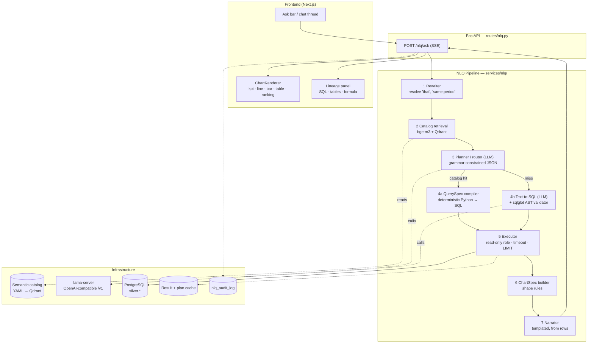

# Genesis NLQ — Natural Language Query Layer: Technical Roadmap

**Milestone:** Ask business questions in plain English → intent understood → SQL generated and
executed against PostgreSQL → accurate answer + auto-generated chart / KPI / table.

**Status of inputs:** Reporting module complete. Tally out of scope. LLM is **self-hosted
llama.cpp** via its OpenAI-compatible API. Supersedes the NL sections of
`GENESIS_SPRINT1_BUILD_PLAN.md` (§1 "Dynamic dashboards", §6a) — that plan's assumptions about
the data layer no longer hold (see §0).

---

## Decisions Locked In

| Decision | Choice |
|---|---|
| Query strategy | **Hybrid.** Catalog-backed QuerySpec on the common path; LLM text-to-SQL fallback for the long tail, behind an AST validator and a read-only role. |
| LLM host | **llama.cpp `llama-server`**, OpenAI-compatible endpoint. GPU node **not yet procured** → build provider-agnostic against a base URL; develop locally, deploy as a config swap. |
| Data scope | **All of `silver.*`** — loan book, GL/financials, and customer PII tables. `bronze.*` excluded. PII returned under a role-gated masking policy (§7.4). |
| Answer style | **Deterministic summary + chart.** Narration is templated from the actual result rows. The LLM translates questions into queries; it never writes prose about numbers and never recommends. |

---

## 0. Gap Analysis — Plan vs. Reality

The Sprint 1 plan designed the NL layer on top of a semantic layer that was never built. Verified
against the codebase and the live database on 2026-07-29:

| Sprint 1 plan assumed | Actual state | Consequence for NLQ |
|---|---|---|
| DE2's metric registry + QuerySpec engine is the foundation | **Absent.** No `services/genesis/`, no `metrics.py`, no QuerySpec/ChartSpec contracts anywhere | NLQ must **build its own semantic layer**. This is the single largest work item, not a dependency we can consume. |
| Normalized warehouse: `customers`, `loans`, `repayments`, `portfolio` | `bronze` (19 raw Prosper tables) + `silver` (19 renamed 1:1 mirrors). **No `gold`/mart layer, no derived metrics** | Queries hit raw operational shapes. Joins and grain are non-obvious; the catalog must encode them explicitly. |
| Tally GL → `journal_entries`, `trial_balance` | Out of scope. GL exists only as `silver.gl_daily_balances` (1,221 rows) + `external_gl_master` (723) | Financial questions answerable only at Prosper-GL granularity. `dnbs02_spec.py` already encodes the hard-won GL-code→line-item mapping — reuse it, don't re-derive it. |
| LLM abstracted behind a base URL | Codebase is **Groq-only** (`app/services/rag.py:139`, `genesis_core/rag.py:269`) | Provider abstraction is net-new (Phase 0). |
| `recharts` for the generic ChartRenderer | **No charting library installed at all** | Entire visualization pipeline is greenfield. |
| Persona-scoped auth | Mock tokens (`app/api/routes/auth.py`), no DB roles | Need a real read-only Postgres role + role-based PII masking. |

**Three findings that shape the design:**

1. **Column names are opaque and undocumented.** `gnlnac_lndisb_amt`, `ascd_dpd_days`,
   `glbbal_ac_bal`. `pg_description` is **empty** for both schemas — zero database comments. No
   LLM infers `gnlnac_pri_repay_amt` = "principal repaid" unaided. A hand-authored catalog is
   mandatory. Seed material exists: `docs/PROSPER_EDA_REPORT.md` §2 already documents product
   codes (1 = Gold, 13 = Microfinance/Retail EMI, 16 = Business/MSME), scheme codes, ledger
   codes and asset-classification codes.
2. **The schema does not fit in a prompt.** `silver.loan_daily_snapshot_summary` alone has **180
   columns**; the 19 silver tables total ~700 columns. Catalog **retrieval** is structural, not an
   optimization.
3. **Provenance is already solved.** `db_schema.py:118 run_section`, `SectionResult`, and
   `db_cursor` (used throughout `dnbs02_service.py`) give us per-query status/error/row-count
   tracking that distinguishes "empty result" from "query failed". Reuse verbatim — a wrong-looking
   zero is the failure mode that destroys trust fastest.

---

## 1. Architecture



### Package layout

```
backend/app/services/nlq/
  contracts.py        # QuerySpec, ChartSpec, Filter, Period, Lineage (Pydantic v2)
  catalog/
    loader.py         # YAML → typed CatalogEntry objects, validated at import
    index.py          # embed entries (bge-m3) → Qdrant collection "nlq_catalog"
    retrieval.py      # question → top-k tables/columns/metrics/enums
    defs/
      tables.yaml     # 19 silver tables: business name, grain, description
      columns.yaml    # curated columns: business name, synonyms, unit, sensitivity
      joins.yaml      # declared join paths + cardinality
      enums.yaml      # product/scheme/asset/branch codes → labels (from EDA §2)
      metrics.yaml    # par_30, collection_efficiency, disbursement_total, ...
      dimensions.yaml # branch, product, scheme, asset_class, month, quarter, fy
  llm/
    client.py         # OpenAI-compatible client (llama.cpp | Groq) behind one interface
    prompts.py        # system prompts, few-shot exemplars
    schemas.py        # JSON schemas passed as response_format for constrained decode
  planner.py          # LLM call → PlanResult (querySpec | sqlDraft | refusal)
  compiler.py         # QuerySpec → SQL (SQLAlchemy Core)
  metrics.py          # metric registry: id → SQL expression + required joins + formula text
  validator.py        # sqlglot AST allowlist for the fallback path
  executor.py         # read-only connection, timeouts, EXPLAIN gate, row caps
  charts.py           # result shape → ChartSpec
  narrator.py         # deterministic summary from rows
  conversation.py     # session state, reference resolution, follow-up handling
  audit.py            # every question/plan/SQL/outcome persisted
backend/app/api/routes/nlq.py
backend/tests/nlq/     # unit + golden-set eval harness
frontend/components/nlq/  # AskBar, ChatThread, ChartRenderer, LineagePanel
```

---

## 2. NLP-to-SQL Workflow

### 2.1 Contracts (build these first — everything else compiles against them)

```python
# contracts.py
class Filter(BaseModel):
    field: str                    # dimension id, must exist in catalog
    op: Literal["eq","ne","in","not_in","gt","gte","lt","lte","between","contains","is_null"]
    value: str | float | list | None

class Period(BaseModel):
    grain: Literal["day","week","month","quarter","fy","year","all"] = "month"
    start: date | None = None
    end: date | None = None
    relative: str | None = None   # "last_quarter" | "ytd" | "last_12_months" | "fy_to_date"

class QuerySpec(BaseModel):
    metrics: list[str]                       # metric ids
    dimensions: list[str] = []               # dimension ids (grouping)
    filters: list[Filter] = []
    period: Period
    compare_to: Period | None = None         # drives variance output
    order_by: OrderBy | None = None
    limit: int = Field(default=200, le=5000)

class Lineage(BaseModel):
    path: Literal["queryspec","text_to_sql"]
    sql: str
    source_tables: list[str]
    formulas: dict[str, str]                 # metric id → human-readable formula
    row_count: int
    duration_ms: int
    as_of: date | None
    warnings: list[str] = []

class ChartSpec(BaseModel):
    chart_type: Literal["kpi","line","bar","grouped_bar","stacked_bar",
                        "table","ranking","variance","scatter","heatmap"]
    title: str
    subtitle: str | None
    x: AxisSpec | None
    series: list[SeriesSpec]
    columns: list[ColumnSpec]                # name, label, unit, format, sensitivity
    rows: list[dict]
    summary: str                             # deterministic narration
    drilldown: QuerySpec | None              # what a click re-runs
    lineage: Lineage
```

`ChartSpec.rows` is always populated even for `kpi`/`line` — the table view and CSV export are
free, and the frontend can switch representation without a round-trip.

### 2.2 The semantic catalog

The catalog is the product. Everything upstream is plumbing.

```yaml
# columns.yaml (excerpt)
- id: loan.disbursed_amount
  table: silver.loan_account_master
  column: gnlnac_lndisb_amt
  label: Disbursed amount
  synonyms: [disbursement, amount given out, loan amount released, released amount]
  unit: inr
  agg: [sum, avg, max]
  description: >
    Cumulative principal actually released to the borrower on this account.
    Differs from sanctioned amount (gnlnac_sanc_amt) for partially drawn facilities.
  sensitivity: internal

- id: customer.name
  table: silver.individual_customer_master
  column: <col>
  label: Customer name
  sensitivity: pii            # masked unless role allows (see §7.4)

# enums.yaml — from docs/PROSPER_EDA_REPORT.md §2
- dimension: product
  column: gnlnac_prod_code
  values: {1: Gold Loans, 13: Microfinance / Retail EMI, 16: Business & MSME Loans}

# metrics.yaml
- id: par_30
  label: Portfolio at Risk (30 days)
  unit: percent
  formula: sum(principal outstanding where DPD > 30) / sum(principal outstanding)
  numerator:   "SUM(ascd_princ_os) FILTER (WHERE ascd_dpd_days > 30)"
  denominator: "SUM(ascd_princ_os)"
  base_table: silver.asset_classification_details
  as_of_column: ascd_effective_date
  grain: point_in_time          # ← must not be summed across dates
  requires_signoff: true        # denominator definition needs client confirmation
```

**`grain` is the field that prevents the most dangerous class of wrong answer.** PAR is a
point-in-time ratio; summing it across months is meaningless. Disbursement is a flow and *must*
be summed. The compiler enforces this — a `point_in_time` metric without a pinned `as_of` date is
rejected before it reaches the database, not silently averaged.

**Authoring order** (highest question-volume first): loan account master → asset classification
(PAR/DPD) → disbursements → repayments → scheme master → branch/product enums → customer masters
→ GL. Budget ~1.5 days of focused work; this is the rate-limiting step for answer quality and it
cannot be automated. Any metric marked `requires_signoff: true` renders with a
"definition pending client sign-off" badge until confirmed.

### 2.3 Retrieval

The infrastructure already exists — `genesis_core/rag.py` gives us bge-m3 embeddings, Qdrant, and
a working chunk/embed/search loop. Reuse it against a new `nlq_catalog` collection.

Per question, retrieve and inject only: top-8 tables, top-25 columns, all metrics whose synonyms
hit, relevant enum blocks, and the join paths connecting the selected tables. Prompt stays
~2-3k tokens instead of the ~40k a full schema dump would need. Hybrid scoring: vector similarity
+ exact synonym/lexical match (BM25-ish), because "PAR" and "DPD" are short acronyms that embed
poorly but match lexically with certainty.

### 2.4 Planner (the routing decision)

One LLM call, `response_format: json_schema`, emitting a tagged union:

```json
{"route": "queryspec",   "spec": {...}, "confidence": 0.0-1.0, "reasoning": "..."}
{"route": "sql",         "intent": "...", "tables": [...], "confidence": ...}
{"route": "clarify",     "question": "Which period did you mean — FY or calendar year?"}
{"route": "refuse",      "reason": "out_of_scope" | "not_in_data" | "predictive"}
```

Routing policy:
- `queryspec` + confidence ≥ 0.6 + validates against catalog → **compile and execute**.
- `queryspec` that fails validation → one repair attempt with the validation error appended → then
  demote to `sql` route.
- `sql` → text-to-SQL generation (second LLM call, §2.6).
- `clarify` → return the question, no execution. Suggest 2-3 concrete rephrasings.
- `refuse` → clean message + 3 example answerable questions. **Refusing well is a feature**: "will
  defaults rise next quarter?" must be refused (predictive, out of brief scope), not answered.

### 2.5 QuerySpec compilation (the trusted path)

Deterministic Python, no LLM. Validation runs *before* SQL generation:

1. Every metric/dimension/filter field exists in the catalog.
2. Metric ↔ dimension compatibility (a GL metric cannot group by loan scheme).
3. All referenced tables are connected by declared joins in `joins.yaml`; ambiguous join paths are
   an error, never a guess.
4. Fan-out check: joining a 1:N table with a `sum` on the 1-side would double-count → reject or
   auto-rewrite to a pre-aggregated subquery.
5. Grain check (§2.2).
6. Period resolution: `relative` → concrete dates via a fiscal-calendar module (**Indian FY:
   April 1 – March 31** — "last year" is genuinely ambiguous here and is a `clarify` trigger when
   the question doesn't disambiguate).

Then SQL is built with **SQLAlchemy Core** — parameter binding by construction, no string
interpolation, and the identical builder serves dashboards later.

### 2.6 Text-to-SQL fallback

Only reached on catalog miss. Generation prompt carries retrieved catalog entries, the exact
`CREATE TABLE` DDL for the selected tables, enum decode tables, 4-6 few-shot exemplars, and hard
rules (schema-qualify everything, no `SELECT *`, always bound by a date filter, always `LIMIT`).

Then `validator.py` parses with **sqlglot** (`read="postgres"`) and rejects unless *all* hold:

| Rule | Rejects |
|---|---|
| Exactly one statement | `; DROP TABLE ...` stacking |
| Root node is `Select` | any DDL/DML/`COPY`/`CALL` |
| Every table ∈ `silver.*` allowlist | `pg_catalog`, `bronze.*`, `public.*` probing |
| No `pg_read_file`, `dblink`, `pg_sleep`, `lo_import`, `COPY … PROGRAM` | file/network/DoS primitives |
| No CTE writes (`INSERT`/`UPDATE`/`DELETE` inside `WITH`) | the classic read-only bypass |
| No `SELECT *` | uncontrolled PII egress |
| No cartesian product (every join has an ON clause) | accidental 13k × 260k explosion |
| `LIMIT` present, ≤ 5000 (injected if absent) | unbounded result sets |
| PII columns present ⇒ caller role permits | unauthorized disclosure |

Then `EXPLAIN` runs and the plan's estimated cost is gated before execution. Validation failure →
one repair round-trip with the reason → then refuse. **Never** return unvalidated SQL to the
executor, and never surface a raw database error to the user (it leaks schema).

The validator is defense-in-depth, not the security boundary. The read-only role (§7.1) is.

---

## 3. LLM Orchestration

### 3.1 Provider abstraction

```python
# llm/client.py
class LLMClient(Protocol):
    async def complete(self, *, messages, json_schema=None,
                       max_tokens=1024, temperature=0.0,
                       timeout_s=30) -> LLMResult: ...
```

Two implementations — `LlamaCppClient` (OpenAI-compatible `/v1/chat/completions`) and
`GroqClient` (already wired, useful for development and as an approved fallback). Selected by env:

```
NLQ_LLM_PROVIDER=llamacpp|groq
NLQ_LLM_BASE_URL=http://<gpu-private-ip>:8080/v1
NLQ_LLM_MODEL=qwen3.6-32b-instruct-q4_K_M
NLQ_LLM_TIMEOUT_S=30
NLQ_LLM_MAX_RETRIES=1
```

Since the GPU node isn't procured: develop against a small local GGUF (or Groq), keep every
prompt under a 4k-token budget so a 24GB-class card remains viable, and treat model selection as
deploy-time config. **Do not** let a model-specific prompt quirk leak into the pipeline.

### 3.2 Constrained decoding

llama.cpp supports GBNF grammars and `response_format: {"type":"json_schema"}`. Pass the QuerySpec
JSON schema on every planner call — the model then *cannot* emit malformed JSON, and validation
reduces to semantics (does this metric exist?) rather than parsing. Groq supports JSON mode but not
arbitrary grammars, so keep a `json.loads` + repair path for the non-llama.cpp branch.

### 3.3 Call budget

| Path | LLM calls | Target latency (A100-class) |
|---|---|---|
| Cache hit | 0 | < 100 ms |
| QuerySpec, clean | 1 | 1.5–3 s |
| QuerySpec + repair | 2 | 3–5 s |
| Text-to-SQL | 2 (plan + generate) | 4–7 s |
| Text-to-SQL + repair | 3 | 6–10 s |

Hard ceiling 20 s, then graceful failure. Stream progress over SSE so the user sees
"Understanding → Planning → Querying → Charting" rather than a spinner.

### 3.4 Degradation

`llama-server` `/health` is polled. When the LLM is down the ask bar shows *"Assistant offline —
dashboards and saved questions fully available"* and the app keeps working: saved QuerySpecs
execute without any LLM involvement. This is why QuerySpec-as-a-contract matters beyond NL.

---

## 4. Prompt Engineering

Three prompts, versioned in `llm/prompts.py` with an explicit `PROMPT_VERSION` recorded in the
audit log so eval scores are attributable.

**System prompt (planner)** — fixed prefix, identical every call so llama.cpp's KV cache is reused:
- Role: translate questions about a **co-operative bank's lending book** into structured queries.
- Hard rules: only catalog metrics/dimensions; never invent columns; never compute or state
  numbers; if the question needs data we don't have, `refuse`; if genuinely ambiguous, `clarify`.
- Domain grounding: Indian FY (Apr–Mar), ₹ lakhs/crores, DPD/PAR/NPA/sanction-vs-disbursement
  distinctions, product code meanings.
- **Explicit refusal training**: predictive questions, advice questions, questions about
  competitors or macro data (that's the RAG module, not NLQ), and anything requiring data outside
  `silver.*`.

**Dynamic context block** — retrieved catalog entries + resolved conversation state.

**Few-shot exemplars** — 8-10 pairs, hand-written against the real schema, deliberately covering:
a simple aggregate; a group-by-dimension; a period comparison; a top-N ranking; a point-in-time
ratio (PAR); a question needing an enum decode; a question that must be **refused**; a question
that must trigger **clarify**. Negative exemplars matter as much as positive ones.

Anti-patterns to avoid: dumping the full schema (blows context, degrades accuracy); chain-of-thought
in the JSON payload (bloats constrained decode — use a short `reasoning` string only); temperature
> 0 (this is a translation task, use 0.0); one mega-prompt doing routing + SQL + charting.

---

## 5. Visualization Pipeline

Chart type is chosen **deterministically from result shape and catalog semantics** — never by the
LLM. Same input always renders the same way, which is what makes it feel like a product rather
than a slot machine.

| Result shape | Chart |
|---|---|
| 1 metric, 0 dimensions | `kpi` tile (+ delta vs `compare_to`) |
| 1 metric, 1 time dimension | `line` |
| 1 metric, 1 categorical, ≤ 12 categories | `bar`, sorted by value |
| 1 metric, 1 categorical, > 12 | `ranking` (top-N + "others"), full table below |
| 1 metric, time × categorical (≤ 6 series) | multi-series `line` |
| 1 metric, time × categorical (> 6) | `stacked_bar` |
| ≥ 2 metrics, 1 dimension | `grouped_bar`, or dual-axis when units differ |
| 2 categorical dimensions | `heatmap` |
| `compare_to` present | `variance` table: A, B, Δ, Δ% |
| No aggregation (row detail) | `table` |
| Empty result | explicit empty state naming the filters that produced it |

Formatting comes from catalog metadata, not guesswork: `unit: inr` → ₹ with lakh/crore
abbreviation; `unit: percent` → 1 decimal; `unit: count` → thousands separators. Dates render as
Indian FY labels where the grain is fiscal.

**Frontend:** install `recharts` (not currently a dependency). One `ChartRenderer` switches on
`chart_type`; each type is a small component. Colors and typography come from the existing
`DESIGN.md` tokens (primary `#005DAA`, Harabara/Inter). Before writing chart code, apply the
`dataviz` skill guidance for the categorical palette, axis/legend/tooltip conventions and
light/dark handling — the palette is a design decision, not a per-chart improvisation.

**Every chart carries its lineage**: SQL, source tables, formula, row count, as-of date, one click
away. Non-negotiable — it is the difference between a demo and a tool a CFO will trust.

---

## 6. Conversation Context Management

Multi-turn is where NL query products earn their keep ("…and by branch?" / "same for gold loans").

**Session state** (`conversation.py`), keyed by `conversation_id`, kept server-side:

```python
class Turn(BaseModel):
    question: str
    resolved_question: str
    plan: PlanResult
    chart_type: str
    row_count: int
    ts: datetime

class ConversationState(BaseModel):
    turns: list[Turn]                # last 5 retained
    active_spec: QuerySpec | None    # the anchor for follow-ups
    entities: dict[str, str]         # {"branch": "3", "product": "16"} sticky filters
```

**Reference resolution runs before retrieval**, as a cheap rewrite step: "and by branch?" +
`active_spec` → "disbursement total for Q1 FY26 grouped by branch". The rewritten question is what
gets embedded, planned and logged — so retrieval sees a complete question and the audit trail
shows what was actually asked. Follow-ups that only add a dimension or change a filter are
detected structurally and **skip the LLM entirely** (mutate `active_spec`, recompile) — instant,
free, always correct.

Rules: context expires after 30 min idle; a question with no pronouns/ellipsis and a new subject
resets the anchor; users can see and clear the sticky filters in the UI (invisible sticky state is
the #1 confusion source in conversational analytics); persist to Postgres, not memory, so context
survives a backend restart.

---

## 7. Security & SQL Validation

Layered — no single control is trusted alone.

### 7.1 Database role (the actual boundary)

```sql
CREATE ROLE nlq_readonly LOGIN PASSWORD :'pw';
REVOKE ALL ON DATABASE moneypaldb FROM nlq_readonly;
GRANT CONNECT ON DATABASE moneypaldb TO nlq_readonly;
GRANT USAGE ON SCHEMA silver TO nlq_readonly;
GRANT SELECT ON ALL TABLES IN SCHEMA silver TO nlq_readonly;
ALTER DEFAULT PRIVILEGES IN SCHEMA silver GRANT SELECT ON TABLES TO nlq_readonly;
REVOKE ALL ON SCHEMA bronze, public FROM nlq_readonly;
ALTER ROLE nlq_readonly SET default_transaction_read_only = on;
ALTER ROLE nlq_readonly SET statement_timeout = '15s';
ALTER ROLE nlq_readonly SET idle_in_transaction_session_timeout = '10s';
ALTER ROLE nlq_readonly SET work_mem = '32MB';
```

Separate connection pool, separate credentials from the app role. Even a total prompt-injection
compromise yields, at worst, a read the user was already authorized to make.

### 7.2 Statement validation
Per §2.6. Applies to the fallback path; the QuerySpec path can't produce arbitrary SQL by
construction.

### 7.3 Prompt injection
The threat is real but bounded: adversarial text can arrive via *data* (a customer name field
containing instructions) that reaches the model in enum lists or result summaries. Mitigations:
never feed result rows back into an LLM (the deterministic-narrator decision removes this vector
entirely); enum values are structurally escaped, not interpolated into instruction text;
constrained decoding means injected text cannot restructure the output; and the read-only role
caps the blast radius.

### 7.4 PII handling
`silver.individual_customer_master` (56 cols), `customer_kyc_details` (42 cols) and
`corporate_customer_master` are in scope per your decision. Policy:
- Every PII column is tagged `sensitivity: pii` in the catalog.
- Columns are **masked by default** in results (`Rajesh K***`, `XXXX-XXXX-4821`) and unmasked only
  for roles that permit it (`gicc_admin`, `gicc_director` — extend `auth.py`).
- `SELECT *` is banned, so PII is only ever returned when explicitly requested.
- PII values are **never** placed in an LLM prompt.
- Every query touching a PII table is flagged in the audit log for review.

> Flagging explicitly: the current auth is mock tokens with no real identity verification
> (`auth.py:13`). Role-gated PII masking is only as strong as that login. Before this touches
> production data, mock auth needs replacing — otherwise the masking is a UI convention, not a
> control. Not a blocker for the build; is a blocker for go-live.

### 7.5 Audit
`nlq_audit_log`: user, role, conversation, raw + resolved question, route taken, plan JSON, final
SQL, row count, duration, outcome, prompt version, model. Retained. This is both the compliance
artifact and the training set for improving the catalog.

### 7.6 Cost / abuse
Per-user rate limit (e.g. 30 questions/min), max concurrent LLM requests, result-row cap of 5000,
and the `EXPLAIN` cost gate before execution.

---

## 8. Performance

| Layer | Technique |
|---|---|
| Result cache | Key = hash(compiled SQL + data version). Data version bumps on ingestion. Snapshot data → high hit rate. Redis, or Postgres table if we're avoiding new infra. |
| Plan cache | Key = normalized question text → QuerySpec. Repeated/demo questions skip the LLM entirely. |
| Prompt cache | Byte-identical system prefix across calls → llama.cpp reuses the KV cache; measurably cuts TTFT. |
| Catalog embeddings | Computed once at build time, persisted in Qdrant. Never per-request. |
| DB indexes | See below — the silver tables were loaded without query-workload indexes. |
| Aggregate tables | If PAR-by-branch-by-month stays slow, materialize a `gold.loan_monthly_agg` refreshed post-ingestion. Measure first. |
| Connection pooling | Dedicated read-only pool, size ~5, `pool_pre_ping`. |
| Streaming | SSE stage updates; render the KPI/table as soon as rows land. |

Indexes to add (derived from the join/filter paths the catalog declares):

```sql
CREATE INDEX ON silver.loan_account_master (gnlnac_appl_brn_code, gnlnac_prod_code);
CREATE INDEX ON silver.loan_account_master (gnlnac_sanc_date);
CREATE INDEX ON silver.loan_account_master (gnlnac_cust_id);
CREATE INDEX ON silver.asset_classification_details (ascd_effective_date, ascd_brn_code);
CREATE INDEX ON silver.asset_classification_details (ascd_account_num);
CREATE INDEX ON silver.loan_repayment_transactions (lnrepay_acnt_no, lnrepay_repay_date);
CREATE INDEX ON silver.loan_disbursement_transactions (genlndisb_acnt_num, genlndisb_disb_date);
CREATE INDEX ON silver.loan_repayment_schedule (<acct_col>);   -- 260k rows, largest table
ANALYZE;  -- planner has no stats on freshly loaded tables
```

Targets: p50 < 3 s, p95 < 8 s end-to-end; SQL execution p95 < 1.5 s. Data volumes are small
(largest table 260k rows) — if a query is slow it is a missing index or a fan-out bug, not scale.

---

## 9. API Design

```
POST   /nlq/ask                  {question, conversation_id?} → SSE stream → AskResponse
POST   /nlq/execute              {query_spec} → ChartSpec         # drill-down, filter change, saved question — no LLM
GET    /nlq/catalog              → metrics, dimensions, example questions  # powers autocomplete
GET    /nlq/conversations/{id}   → turn history
DELETE /nlq/conversations/{id}   → clear context
POST   /nlq/feedback             {turn_id, verdict, comment}      # the catalog improvement loop
GET    /nlq/suggestions          {context?} → suggested next questions
GET    /nlq/health               → {llm: ok|degraded, db: ok, catalog_version, model}
```

`AskResponse` = `{conversation_id, turn_id, status: answered|clarify|refused, chart: ChartSpec?, clarification?, refusal?, plan_summary}`.

Conventions follow the existing codebase: `APIRouter(prefix="/nlq", tags=["nlq"])` mounted in
`main.py`, Pydantic request/response models, `HTTPException` for errors — matching
`routes/regulatory.py`. SSE events: `stage`, `plan`, `chart`, `error`, `done`.

`/nlq/execute` is deliberately LLM-free: it's what makes drill-downs instant, saved questions
reliable, and dashboards buildable on the same engine.

---

## 10. Frontend Integration

New route `/ask` plus an embeddable `<AskBar/>` on existing dashboards.

- **AskBar** — input with autocomplete from `/nlq/catalog`, example-question chips when empty.
- **ChatThread** — question/answer turns; each answer = summary line + chart + collapsible lineage.
- **ChartRenderer** — switches on `chart_type`; recharts (new dependency); `DESIGN.md` tokens;
  `dataviz` skill for palette/axis/tooltip conventions.
- **LineagePanel** — SQL (syntax-highlighted), source tables, formula, row count, as-of date, "Copy
  SQL", "Export CSV".
- **Drill-down** — clicking a bar/row posts `chart.drilldown` to `/nlq/execute`. No LLM, instant.
- **Refusal & clarification states** — first-class UI, not error toasts. A refusal shows three
  answerable example questions; a clarification shows tappable options.
- **Sticky-filter chips** — visible, dismissible representation of conversation context (§6).
- **Feedback** — 👍/👎 per answer → `/nlq/feedback` → catalog backlog.
- **Offline state** — when `/nlq/health` reports the LLM degraded, the bar disables with a clear
  message; saved questions still run.

Reuse `frontend/lib/api.ts` conventions and the existing `GenesisSearch.tsx` interaction patterns
(mode toggle, loading, error, clear) — users already know that shape.

---

## 11. Testing Strategy

| Layer | Approach |
|---|---|
| Catalog | Schema-validate every YAML at import; assert every referenced table/column **actually exists** in Postgres (introspection test — catches drift immediately). |
| Compiler | Snapshot tests: QuerySpec → expected SQL. Fast, no LLM, no DB. |
| Metrics | **Hand-computed fixtures.** Small fixture dataset with PAR/collection-efficiency/disbursement values worked out on paper. Highest-rigor tests in the module — a wrong PAR in front of a CFO ends the project. |
| Validator | Adversarial suite: stacked statements, CTE writes, `pg_read_file`, cross-schema access, cartesian products, `SELECT *`, comment-obfuscated injection. Each must be rejected. |
| Planner | **Golden question set of ~120 questions** with expected route + expected QuerySpec. Scored on *execution match* (same result set) not string match — many SQL spellings are correct. Run in CI against a pinned model; report accuracy per category. |
| Charts | Result shape → expected `chart_type`, table-driven. |
| Conversation | Multi-turn scripts asserting correct reference resolution and context expiry. |
| E2E | Question → HTTP → chart JSON, against a seeded test database. |
| Regression | Every 👎 in `/nlq/feedback` becomes a golden-set case. The eval set grows from real failures. |

The golden set is the deliverable that makes quality measurable. Build it in Phase 1 — before the
LLM exists — by writing questions and their correct QuerySpecs by hand. It then serves as both
spec and test.

---

## 12. Deployment

`llama-server` is hosted and operated **outside** this compose stack — the app reaches it purely
through config, so `docker-compose.yml` is unchanged:

```
NLQ_LLM_PROVIDER=llamacpp
NLQ_LLM_BASE_URL=http://<gpu-private-ip>:8080/v1
NLQ_LLM_MODEL=qwen3.6-32b-instruct-q4_K_M
```

Reference invocation on the GPU node (for the runbook, not for compose):

```
llama-server -m qwen3.6-32b-instruct-q4_K_M.gguf \
  -ngl 99 -c 8192 --parallel 4 --host 0.0.0.0 --port 8080
```

Network: llama-server bound to the private VPC IP only, **never internet-exposed** (the endpoint is
unauthenticated); security group allows 8080 from the app node only. `/nlq/health` polls its
`/health` and degrades the ask bar when it is unreachable. Postgres and all customer data stay on the app node — the GPU
node holds model weights and receives only questions plus catalog metadata, never loan or customer
rows.

Rollout: (1) catalog + compiler + `/nlq/execute` behind a feature flag; (2) `/nlq/ask` with the
LLM, internal users only; (3) golden-set accuracy gate ≥ 85% on the QuerySpec path before persona
users; (4) general availability. Pin the exact GGUF file hash in the runbook so a node rebuild is
reproducible. Ops: `/nlq/health` on the existing platform dashboard; alerts on LLM error rate,
p95 latency, refusal rate, and validator rejection rate (a spike means the catalog has a gap).

---

## 12a. Build Status (2026-07-29)

All five phases are implemented. 489 backend tests pass, 16 skip pending the `nlq_readonly`
role. What was found along the way, and what remains, is recorded honestly below.

**Corrections to this plan discovered during the build — the plan was wrong about these:**

| Assumed | Actual | Consequence |
|---|---|---|
| `asset_classification_details` can be read as a snapshot | It is an **event log**: a given `effective_date` holds only accounts reclassified that day (364 rows on the latest date, 5,238 accounts overall) | `WHERE effective_date = X` reports PAR 30 as **NULL** where the correct answer is 0.090%. The compiler collapses with `DISTINCT ON` and never by equality |
| `gl_daily_balances` is a daily time series | **No date column exists.** Grain is annual (`glbbal_year`); `glbbal_last_tran_date` is last activity, not a balance date | Monthly and quarterly GL questions are unanswerable and are refused, not approximated |
| Classification history spans the book's life | It starts **2026-05-22** — about six weeks | PAR trends before that render as explicit gaps rather than zeros |
| Disbursement events cover the book | Event log starts 2025-10-15: ₹217.1 Cr of events against ₹296.1 Cr cumulative | Period-scoped disbursement uses the event table; whole-book totals use the loan master. Every answer carries the caveat |
| Dual-axis charts where units differ (§5) | Two y-scales invite a false reading of crossings and correlation | Mixed-unit results render as a table. Never a second axis |

**Measured, not assumed:** PAR 30 = 0.090%, collection efficiency = 97.93%, disbursement
= ₹217.08 Cr, sanctioned = ₹307.62 Cr, whole-book outstanding = ₹275.22 Cr, classified
outstanding = ₹198.47 Cr, delinquent accounts = 244, max DPD = 75 (so PAR 90 and the NPA
ratio are genuinely 0.00%, not missing). Each is a hand-computed fixture in
`test_metrics_fixtures.py`, checked against independently written SQL.

**Not yet done, and why:**

- `nlq_readonly` is not provisioned — `CREATE ROLE` needs a superuser, and the app role has
  neither SUPERUSER nor CREATEROLE. 16 tests skip until it exists.
- Golden-set accuracy is **not yet measured on a production model**. The harness works and
  scores on execution match; the development provider's free tier cannot fund a 54-case run
  (~3.9k tokens per call). Manual spot-checks routed 18/18 correctly, including all negative
  cases — that is a sample, not the 85% gate.
- Catalog vectors are not in Qdrant (`qdrant_client` cannot import in the dev sandbox);
  retrieval runs lexical-only and reports which mode it is in.
- `llama-server` has never run against this code — constrained JSON decoding is verified
  through the Groq `json_object` path and stub-transport tests, not the `json_schema` grammar.

---

## 13. Build Plan

Phases, not calendar days — sequenced by dependency. Estimates assume one engineer full-time;
Phases 3 and 4 parallelize across two.

### Phase 0 — Foundations (~3 days)
1. `contracts.py`: QuerySpec, ChartSpec, Filter, Period, Lineage. **Merge before anything else** —
   every other module compiles against these.
2. `llm/client.py`: provider-agnostic OpenAI-compatible client; llama.cpp + Groq implementations;
   env-driven selection; `/health` probe.
3. Point `NLQ_LLM_BASE_URL` at an externally hosted `llama-server`; verify constrained JSON
   decoding works against it.
4. `nlq_readonly` Postgres role (§7.1) + dedicated pool; verify writes are rejected.
5. `routes/nlq.py` skeleton with `/nlq/health`; mounted in `main.py`.
6. Add the §8 indexes; run `ANALYZE`.

**Exit:** `/nlq/health` green; a hand-written QuerySpec round-trips through Pydantic; the read-only
role provably cannot write.

### Phase 1 — Deterministic core, no LLM (~5 days)
7. Author `catalog/defs/*.yaml` for the loan book (loan_account_master, asset_classification,
   disbursements, repayments, scheme master) + enums from `PROSPER_EDA_REPORT.md` §2. **~1.5 days,
   the highest-leverage work in the project.**
8. `catalog/loader.py` + the introspection test asserting every column exists.
9. `metrics.py`: 12-15 core metrics with formulas, grain, and required joins. Flag anything whose
   definition needs client sign-off.
10. `compiler.py`: QuerySpec → SQL (SQLAlchemy Core) with all six validation gates (§2.5).
11. `executor.py` reusing `db_cursor` / `run_section` / `SectionResult` from `db_schema.py`.
12. `charts.py` shape rules + `narrator.py` templates.
13. `POST /nlq/execute` live.
14. **Write the golden question set (~120 questions with hand-authored expected QuerySpecs).**
15. Metric fixture tests with hand-computed expected values.

**Exit:** hand-written QuerySpecs produce correct ChartSpecs from real data, verified by hand for
at least PAR 30, collection efficiency and disbursement total. **No LLM involved yet — and the
system is already useful.**

### Phase 2 — NL understanding (~4 days)
16. Catalog embedding + `nlq_catalog` Qdrant collection (reuse `genesis_core/rag.py`).
17. `retrieval.py`: hybrid vector + lexical, top-k assembly with join closure.
18. `prompts.py`: system prompt, few-shot exemplars incl. refusal and clarify cases.
19. `planner.py`: constrained-decode call → PlanResult; validation + one repair round-trip.
20. `POST /nlq/ask` with SSE staging.
21. Eval harness scoring the golden set on execution match; baseline accuracy recorded.

**Exit:** typed question → chart, end to end. Golden-set QuerySpec accuracy ≥ 70% (raise later).

### Phase 3 — SQL fallback + hardening (~3 days)
22. `validator.py` (sqlglot) + the full adversarial rejection suite.
23. Text-to-SQL generation prompt; `EXPLAIN` cost gate; sandboxed execution.
24. Lineage assembly for the SQL path.
25. `audit.py` + `nlq_audit_log` table.
26. PII masking policy + role gating; rate limiting.

**Exit:** off-catalog questions answered safely; every adversarial test rejected; every query
audited.

### Phase 4 — Frontend (~4 days, parallelizable with Phase 3)
27. `npm i recharts`; `ChartRenderer` for kpi/line/bar/grouped/stacked/table/ranking/variance,
     applying `dataviz` guidance and `DESIGN.md` tokens.
28. `AskBar` + `ChatThread` + SSE consumption.
29. `LineagePanel` (SQL, tables, formula, export).
30. Drill-down wiring to `/nlq/execute`.
31. Refusal, clarification, empty, loading, offline states.
32. Feedback control → `/nlq/feedback`.

**Exit:** a non-technical user can ask a question and get a chart with visible lineage.

### Phase 5 — Context, tuning, deploy (~4 days)
33. `conversation.py`: session state, reference rewriting, structural follow-ups, sticky-filter UI.
34. Result/plan/prompt caching.
35. Accuracy tuning against the golden set: catalog synonyms, exemplars, retrieval weights. **Most
    accuracy gains come from the catalog, not the prompt** — resist prompt-fiddling first.
36. Load/latency testing to the p50 < 3 s / p95 < 8 s targets.
37. GPU-node deployment (when procured), runbook, model-hash pinning, monitoring + alerts.
38. Demo script: 15 rehearsed questions per persona, all green on the target model.

**Exit:** deployed, monitored, ≥ 85% golden-set accuracy on the QuerySpec path, demo-ready.

**Total: ~19 engineer-days serial, ~15 with Phases 3/4 parallelized.**

---

## 14. Risks

| Risk | Impact | Mitigation |
|---|---|---|
| **Catalog quality is the accuracy ceiling** | Mediocre answers regardless of model | Budget real time for authoring; treat feedback → catalog as the primary tuning loop, not prompt tweaking |
| **No `gold` layer — metrics computed on raw operational tables** | Fan-out double-counting; subtle wrong numbers | Explicit join cardinality + grain in the catalog; fan-out gate in the compiler; hand-computed fixtures |
| **Metric definitions unratified** (PAR denominator, NPA basis) | Confidently wrong numbers in front of a CFO | One-page metric-definitions doc for client sign-off; `requires_signoff` badge in the UI until confirmed |
| **GPU not procured** | Unknown production latency/quality | Provider-agnostic client; 4k-token prompt budget keeps 24GB cards viable; golden set re-run on the final model before GA |
| **Text-to-SQL fallback returns plausible-but-wrong results** | Trust damage — worse than a refusal | Prefer refusal over low confidence; always show the SQL; mark fallback answers visually as unverified |
| **PII exposure through a mock-auth login** | Compliance incident | Mask by default; role-gate; audit; **replace mock auth before production data** (§7.4) |
| **Conversation context confuses users** | "Why is it still filtered to Branch 3?" | Sticky filters always visible and dismissible; context expiry; anchor reset on subject change |
| Scope creep into recommendations/forecasting | Breaches the brief's "no AI-generated recommendations" line | Deterministic narrator; predictive questions are an explicit refusal category with exemplars |

---

## 15. Definition of Done

- A director types *"What was our disbursement by branch last quarter?"* → correct chart in < 3 s,
  with SQL and formula one click away.
- Follow-up *"and by product?"* works without repeating context — and without an LLM call.
- *"Will defaults rise next quarter?"* is cleanly refused with three answerable alternatives.
- Every number traceable: SQL + source tables + formula + as-of date, on every answer.
- Golden set: ≥ 85% accuracy on the QuerySpec path; 100% of the adversarial SQL suite rejected.
- No write is possible from the NLQ path under any input (proven by test, not by inspection).
- LLM offline → dashboards and saved questions keep working, with a clear message.
- Every question, plan, and SQL statement audited.
