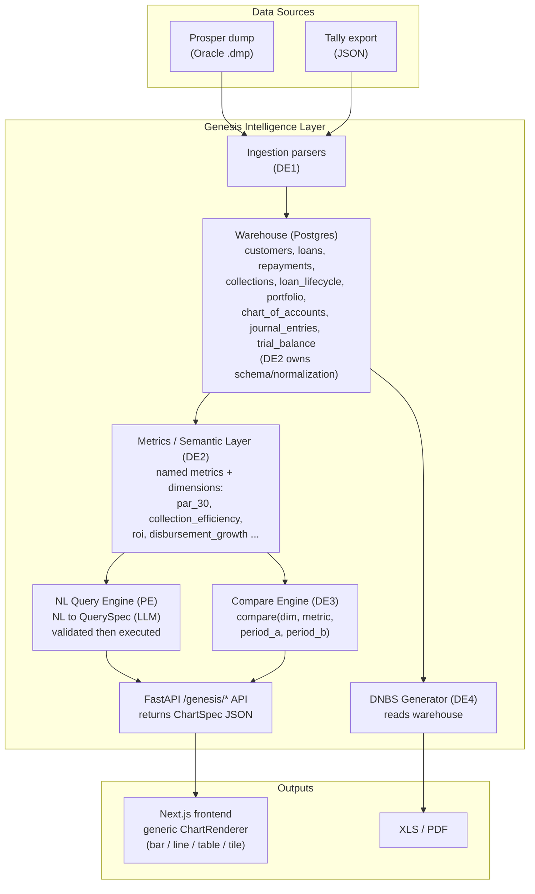

# Genesis Intelligence Layer — 14-Day Build Plan

**Team:** 4 Data Engineers (DE1–DE4) + 1 Platform Engineer (PE)
**Deliverables:** Module 1 (Economic Intelligence dashboards), Module 2 (Competitive Intelligence — self-comparison, per the brief), Module 3 (DNBS report as on 30-06-2026 — hard deadline, does not carry forward)
**Companion docs:** `GENESIS_INTELLIGENCE_LAYER.md` (what/why), `GENESIS_INTELLIGENCE_LAYER_GLOSSARY.md` (terms)

---

## Decisions Locked In

| Decision | Choice |
|---|---|
| Data layer | **Plain Postgres warehouse** — normalized tables per source entity (customers, loans, repayments, journals, trial_balance, ...), loaded by ingestion scripts, queried directly by the metrics layer. No event log, no projections/replay. See "Why we dropped the event model" below. |
| Dashboards | **Dynamically rendered from user queries**: NL query bar → LLM translates to a validated structured query → generic chart renderer. Plus standard filter-driven dashboards as the base. |
| Deployment | **Client infrastructure on E2E Networks** — CPU node (app + Postgres) + GPU node (local LLM) in one VPC; we spec requirements (see §6) |
| Data in hand | **Prosper Oracle dump received** (`.dmp`, 30-Jun-2026 snapshot — imported via Oracle Data Pump / `impdp` or converted, then loaded into Postgres). **Tally export confirmed as JSON** (client is exporting Tally ERP data to JSON, not XML/CSV). DNBS template **not yet received — critical blocker, request on Day 1**. |

### Why we dropped the event model

Sprint 1's inputs are two **point-in-time batch snapshots** (Oracle dump, Tally JSON export as on 30-06-2026), not a live transaction stream. There's no requirement to replay history, no multiple independent consumers projecting the same events, and re-running ingestion just means re-loading the dump. An append-only event log + projections earns its cost only when you need those things — here it would just be a slower, harder-to-debug way to build the same tables. **Load the source data straight into normalized Postgres tables; re-ingestion is idempotent via truncate-and-reload (or upsert on natural keys) per source, not event replay.**

If/when NEST/NAB (the separate continuous event-sourcing initiative) lands, Genesis can point its warehouse at NAB's projections later — that's a future integration, not something to build speculatively now.

---

## 1. Architecture

### The warehouse model (answers the "postgres event based database??" question)

- **No event log, no projections.** Ingestion parses the Oracle dump and the Tally JSON export and loads them straight into normalized Postgres tables — one table per source entity, matching the "Core entities" spec in `GENESIS_INTELLIGENCE_LAYER.md`.
- **Re-ingestion is idempotent by truncate-and-reload per source table** (or upsert on natural key — e.g. `loan_id`, `journal entry id` — where the source supports incremental deltas). Since each source is a single point-in-time snapshot, truncate-and-reload is simplest and matches how the data actually arrives.
- **Metrics are pure functions over warehouse tables** — same contract as before (`par_30 = overdue_30d_principal / total_outstanding_principal`, etc.), just computed directly over the loaded tables instead of over event-replay projections. Every number is still traceable to a source table + formula.
- **Ingestion specifics:**
  - **Prosper (Oracle dump):** the `.dmp` file is an Oracle Data Pump export — import it into a scratch Oracle instance (or use `impdp`-compatible tooling) to materialize tables, then extract to CSV/Parquet, or read directly via `oracledb`/`cx_Oracle` if a live Oracle endpoint is available for the import. DE1 picks whichever round-trip is faster given tooling on hand; either way, the output is one Postgres table per Prosper entity.
  - **Tally (JSON export):** client exports Tally ERP as JSON (confirmed — supersedes the earlier XML/CSV assumption). DE1 writes a JSON parser mapping Tally's export shape → `chart_of_accounts`, `journal_entries`, `trial_balance`, `profit_loss`, `balance_sheet` tables. Get a sample JSON file on Day 1 to confirm the exact shape (flat array per report vs. nested ledger tree) before committing to a schema.

If/when NEST/NAB's continuous event-sourcing pipeline lands, Genesis's warehouse can be repointed to read from NAB's projections instead of the batch loaders — a future swap, not part of this sprint.

### Dynamic dashboards — the ChartSpec contract

The key design that makes "dynamically rendered based on the query" work with 5 people in 14 days:

1. **Semantic layer** (DE2): a registry of named metrics (`par_30`, `collection_efficiency`, `disbursement_total`, `roi_portfolio`, …) and dimensions (`branch`, `product`, `officer`, `month`, `quarter`) — each metric is a pure function over projections.
2. **QuerySpec** (the universal request): `{metrics: [...], dimensions: [...], filters: {...}, period: {...}, compare_to?: {...}}`. Everything — fixed dashboards, filter changes, NL queries — compiles down to a QuerySpec.
3. **ChartSpec** (the universal response): `{chart_type: tile|line|bar|stacked_bar|table|ranking, title, x, series[], data[], source_tables[], formula}`. The frontend has ONE generic `ChartRenderer` that can draw any ChartSpec.
4. **NL path** (DE4): user types "show collections by branch last quarter" → LLM (with the semantic-layer catalog in its prompt) outputs a QuerySpec → **validated against the catalog (reject anything not a known metric/dimension)** → executed by the same engine → ChartSpec → rendered.

> **Scope guard:** the LLM never generates numbers or recommendations — it only *translates a question into a query*. All numbers come from SQL over projections. This keeps us inside the brief's "no AI-generated recommendations" boundary. Every ChartSpec carries `source_tables` + `formula` so every number is traceable.

---

## 2. Roles — Who Builds What

### DE1 — Ingestion Lead
Owns: raw dumps → warehouse tables.
- Import/extract the Prosper Oracle `.dmp` (all tables: customers, loans, repayments, collections, lifecycle, portfolio) → typed Postgres tables.
- Parse the Tally **JSON** export (COA, journals, trial balance, P&L, balance sheet) → typed Postgres tables.
- Data-quality report: row counts, null rates, orphan loan IDs, date-range sanity — reviewed with client SME.
- Warehouse schema doc: the definitive column list per table (co-designed with DE2 in days 1–2).
- Idempotent re-runs: re-ingesting the same dump/export must not duplicate or double-count rows (truncate-and-reload or upsert on natural key).

### DE2 — Warehouse, Metrics & Semantic Layer Lead
Owns: raw tables → queryable numbers. **The center of the system.**
- Warehouse schema (`customers`, `loans`, `repayments`, `collections`, `loan_lifecycle`, `portfolio`, `chart_of_accounts`, `journal_entries`, `trial_balance`) — normalized, indexed, matching DE1's ingestion output.
- The semantic layer: every metric in `GENESIS_INTELLIGENCE_LAYER.md` §Dashboard-Level Spec as a registered, tested, pure function (PAR 30/60/90, collection efficiency, disbursement growth, customer growth, ROI per portfolio from GL, DPD buckets, early-warning rule flags).
- The QuerySpec execution engine: QuerySpec in → SQL over warehouse tables → ChartSpec out.
- Metric correctness tests with hand-computed fixtures (a wrong PAR number in front of a CEO kills credibility — this is the highest-rigor code in the sprint).

### DE3 — Competitive (Self) Intelligence & Dashboard API Lead
Owns: Module 2 + the API surface for Module 1.
- Generic `compare(dimension, metric, period_a, period_b)` on top of DE2's engine → variance reports (Δ, Δ%), rankings, trend series.
- Branch / product / officer comparison endpoints + MoM/QoQ/YoY period logic (fiscal-year aware).
- The `/genesis/*` FastAPI routes for all Module 1 dashboards (Business, Portfolio, Growth, Collections) — each dashboard is just a curated set of QuerySpecs.
- Registry files (`registry/branches/`, `products/`, `officers/` JSON) generated from ingested data so comparisons never hardcode entity lists.

### DE4 — Regulatory (DNBS) Lead
Owns: the one non-negotiable "special" deliverable. **NL/AI query engine moved to PE (see below) — DE4 is single-threaded on DNBS.**
- Obtain the exact DNBS return format; map every schedule field to warehouse tables/metrics.
- Build `generate_dnbs_report.py --as-of 2026-06-30` → XLS/PDF in the prescribed layout, validated against the client's last manually-filed return.
- Chase the DNBS template + last-filed return from the client (Day 1, escalate if late) — this is the hard deadline, no fallback if it slips.
- With the full sprint to itself, DE4 also owns the GRC-flavored dashboard view (portfolio concentration, overdue accounts, provisioning, policy-breach flags) mentioned in `GENESIS_INTELLIGENCE_LAYER.md` — same underlying data as DNBS, not in the original three deliverables but low-marginal-cost given DE4's schedule headroom.

### PE (You) — Platform, Integration, Frontend Shell & AI/NL Query Engine
Owns: everything runs, nothing breaks, the pieces fit — **plus the NL→query AI path end to end.**
- **Days 1–2:** Postgres on client infra (or local until client VM lands), warehouse schema migrated (working with DE2), repo scaffolding (`services/genesis/`, `routes/genesis.py`), CI, dev environment for all 4 DEs, and the ChartSpec/QuerySpec Pydantic contracts committed **before anyone writes module code** (this is the Hour-0 "shared schema" lesson from the buildathon).
- **AI / NL query engine (moved from DE4 to PE):** prompt design with the semantic-layer catalog injected → self-hosted LLM (llama-server, §6a) → QuerySpec, grammar-constrained JSON output, strict semantic validation (reject unknown metrics/dimensions), graceful "I can't answer that" refusal, `/genesis/ask` endpoint. Additive feature — if it slips, dashboards still work filter-driven; DNBS is unaffected since DE4 no longer depends on you for it either way.
- **Frontend:** the generic `ChartRenderer` (recharts) + dashboard page shells + NL query bar UI + filter controls, reusing the existing Next.js app, auth, and nginx routing. New `/genesis/*` frontend routes; Gen 1 app untouched.
- **Client infra:** spec, request, and provision the client environment (§6, incl. the GPU node for the LLM); deploy pipeline (docker-compose extension) to it.
- **Integration:** you are the cross-spec mismatch detector — run end-to-end (dump → warehouse table → metric → ChartSpec → rendered chart) as early as Day 5 with one metric, then continuously.
- **Not yours:** metric formulas, DNBS field mapping, warehouse schema design (DE2 owns the schema, you own standing up and migrating it) — flag issues to the owning DE, don't decide.

---

## 3. Tech Stack

| Layer | Choice | Notes |
|---|---|---|
| Database | **PostgreSQL 16** | Plain normalized warehouse — one schema `genesis`, one table per source entity (`customers`, `loans`, `repayments`, `collections`, `loan_lifecycle`, `portfolio`, `chart_of_accounts`, `journal_entries`, `trial_balance`), indexed on natural keys + date columns. No event log. |
| Ingestion | Python + **pandas** | Oracle `.dmp` import (Data Pump / `impdp`, then extract) for Prosper; **JSON parser** for the Tally export; runs as scripts, not services |
| Backend | **FastAPI** — extend the existing app | New router `routes/genesis.py`, service package `services/genesis/`; same process, same nginx |
| Semantic/query layer | Plain Python + SQLAlchemy Core (no heavy BI framework) | Metric registry as decorated functions; QuerySpec → SQL compiler is ~1 file |
| NL→Query LLM (owned by PE) | **Primary: self-hosted LLM on an E2E GPU node** — **llama.cpp** (`llama-server`, CUDA build) serving **Qwen 3.6 35B** (instruct) GGUF, JSON-schema-constrained output. **Contingency: a ~14B Qwen on the CPU node; fallback: Groq `llama-3.3-70b`** if client approves egress | Self-hosted keeps all data + questions inside the client's E2E VPC (zero third-party egress → §6 item 8 becomes a non-issue). llama.cpp's grammar-constrained decoding guarantees syntactically valid QuerySpec JSON. The backend targets an OpenAI-compatible base URL, so GPU↔CPU↔Groq is a config change only. See §6a. |
| Frontend | Existing **Next.js 15 + Tailwind + shadcn/ui**, **recharts** | One generic ChartRenderer + MetricTile, TrendChart, RankingTable, VarianceTable components |
| DNBS output | **openpyxl** (XLS in prescribed layout) + optional PDF via weasyprint | Format driven entirely by the official DNBS template |
| Deploy | Docker Compose + nginx (existing pattern) on **E2E Networks**: CPU node (app + Postgres) + GPU node (llama-server) in one VPC | Add `postgres` service on the CPU node, `llamacpp` (llama-server CUDA) on the GPU node; Gen 1 containers unchanged |
| Testing | pytest, metric fixtures with hand-computed expected values | CI on every push |

---

## 4. 14-Day Timeline

**Milestone gates:** Day 5 = one metric end-to-end. Day 9 = all dashboards on real data + DNBS draft. Day 13 = client-validated DNBS + demo rehearsed.

| Day | DE1 (Ingestion) | DE2 (Warehouse/Metrics) | DE3 (Compare/API) | DE4 (DNBS) | PE (Platform + AI) |
|---|---|---|---|---|---|
| **1** | Import Prosper Oracle dump, inventory tables w/ DE2 | Co-design warehouse schema with DE1 | Study brief, draft QuerySpec metric list | **Chase DNBS template + confirm Tally JSON sample from client** — start DNBS field research | Contracts committed (QuerySpec/ChartSpec/warehouse schema), repo scaffold, local Postgres, **send client infra request (§6)** |
| **2** | Prosper loader: customers, loans → Postgres | Warehouse tables skeleton, metric registry skeleton | Period logic (MoM/QoQ/YoY, fiscal year) | DNBS schedule → field mapping doc (v1) | Dev env for all DEs, CI, migrations, frontend shell + routes; **start local llama-server + GGUF download** |
| **3** | Prosper loader: repayments, collections, lifecycle | `loans`, `repayments` tables populated for real | `compare()` engine v1 on stub data | DNBS mapping review w/ DE2 (which metrics exist vs needed) | ChartRenderer v1 (tile, line, bar, table) |
| **4** | Full Prosper load run + data-quality report | First real metrics: disbursement totals, PAR 30 | Branch/product registries from real data | DNBS: continue field mapping against Prosper tables | Wire API↔frontend with stub ChartSpecs; **NL prompt v1 (metric-catalog injected) + QuerySpec validation layer** |
| **5** | **GATE:** fix DQ issues found | **GATE: one metric end-to-end** (dump→warehouse table→PAR 30→chart on screen) | Compare engine on real warehouse tables | DNBS field mapping v2 incorporating DE2's real metrics | **GATE: first NL→QuerySpec→chart round trip**; run the gate demo; integration fixes; client infra should be delivered — deploy skeleton to it |
| **6** | Tally JSON loader (sample confirmed Day 1; **escalate if full export not in hand**) | Collection efficiency, DPD buckets, growth metrics | Business + Portfolio dashboard endpoints | DNBS generator skeleton (openpyxl, prescribed layout) | Dashboard pages: Business, Portfolio (filter-driven) |
| **7** | Tally load: journals, trial balance → Postgres | `gl_balances` view/table + ROI-per-portfolio metrics | Growth + Collections dashboard endpoints | DNBS: populate schedules from real warehouse data | Dashboard pages: Growth, Collections; NL query bar UI wired to `/genesis/ask` |
| **8** | Idempotency + re-run hardening; DQ report v2 | Early-warning rule flags; metric test fixtures | Variance reports + rankings endpoints (Module 2) | DNBS draft v1 generated from real data | Module 2 comparison UI (rankings, variance tables); **run §6a local-LLM acceptance test (20 canned questions)** |
| **9** | **GATE support** | **GATE: all metrics real, tested** | **GATE: all 4 dashboards + comparisons live on real data** | **GATE: DNBS draft v1 to client for validation** | Full end-to-end on client infra (incl. NL path), auth wired, Gen 1 regression check |
| **10** | Buffer: data issues surfaced by dashboards | Metric fixes from dashboard review | Officer comparisons, fiscal edge cases | DNBS: incorporate client feedback round 1 | **NL hardening**: refusal cases, ambiguous-question handling; Finance dashboard (ROI) + polish |
| **11** | Support | Support + performance (indexes, slow queries) | Drill-downs: click a number → underlying breakdown | GRC dashboard view (portfolio concentration, overdue, provisioning, policy flags) | Error/loading/empty states; mobile check; **verify llama-server restart-resilience on GPU node** |
| **12** | Freeze ingestion | Freeze metrics | Freeze API | DNBS v2 (client-corrected) | Full deploy to client infra, backups configured |
| **13** | — | — | — | **DNBS final, client sign-off** | **Demo rehearsal** (CEO/CFO/Compliance 5-min paths per persona, incl. one live NL question) |
| **14** | **DELIVERY** — Sprint review: 3 personas walk through Genesis; DNBS report handed over | | | | |

**Slack in the plan:** Days 10–11 are deliberately buffer-heavy; the Tally export arriving late is the biggest schedule risk (Finance/ROI metrics and parts of DNBS depend on it — everything Prosper-driven proceeds regardless). Since Tally is confirmed as JSON, DE1 should get a sample file Day 1 to de-risk the parser early rather than discovering shape surprises Day 6.

---

## 4a. Day-by-Day Detail (per engineer)

Daily cadence: 15-min standup at 09:30; end-of-day, each engineer posts what merged and what's blocked. Gate days (5, 9, 13) end with a demo, not a status update.

### Day 1 — Contracts, warehouse schema, client asks
- **DE1:** Import the Prosper Oracle `.dmp` locally (Data Pump / `impdp` or equivalent); inventory every table (row counts, columns, obvious keys); with DE2, draft the warehouse schema v0. Also request a **sample Tally JSON export file** from the client to confirm shape before committing to a JSON-parser schema. Output: `docs/warehouse_schema.md` draft.
- **DE2:** Co-design warehouse schema with DE1 (table per Prosper/Tally entity, matching `GENESIS_INTELLIGENCE_LAYER.md`'s "Core entities" tables); list every metric from the brief with its formula and required inputs. Output: metric inventory sheet.
- **DE3:** Read the brief + glossary end-to-end; enumerate every dashboard's charts as QuerySpecs on paper; identify the dimension list (branch, product, officer, period grains). Output: dashboard→QuerySpec mapping doc.
- **DE4:** Send the formal client request for the DNBS template + last filed return (with PE); in parallel start researching the public RBI DNBS return structure. Output: request sent + DNBS schedule outline v0.
- **PE:** Commit the Pydantic contracts (`QuerySpec`, `ChartSpec`, warehouse table schemas) — **before any module code**; scaffold `services/genesis/` + `routes/genesis.py`; local Postgres with one `genesis` schema; send the infra request (§6, incl. the §6a local-LLM VM sizing). Output: contracts merged to main.

### Day 2 — Skeletons everywhere
- **DE1:** Prosper loader for customers + loans → Postgres `customers`, `loans` tables (truncate-and-reload).
- **DE2:** Warehouse migration for all tables (`customers`, `loans`, `repayments`, `collections`, `loan_lifecycle`, `portfolio`, `chart_of_accounts`, `journal_entries`, `trial_balance`); metric-registry skeleton (decorator, catalog export for the NL prompt).
- **DE3:** Period logic module: MoM/QoQ/YoY resolution, fiscal-year awareness, `period_a/period_b` derivation — fully unit-tested (this is pure logic, no data needed).
- **DE4:** DNBS field-mapping doc v1: every schedule field → source (warehouse table/metric) → status (have / need Tally / need client answer).
- **PE:** Dev environment reproducible for all 4 DEs (compose up = working stack); CI running pytest on push; Alembic migrations for the `genesis` schema; Next.js `/genesis/*` route shells behind existing auth. **Start the `llamacpp` (llama-server) compose service locally + download a small Qwen GGUF (~14B q4 for dev laptops; production Qwen 3.6 35B runs on the E2E GPU node); begin drafting the NL prompt v0 (metric-catalog format).**

### Day 3 — First real data flowing
- **DE1:** Prosper loader for repayments, collections, lifecycle; first full-table load of loans+customers into Postgres.
- **DE2:** Verify `loans` + `repayments` tables populated for real from DE1's loader; row counts checked against DE1's inventory.
- **DE3:** `compare()` engine v1 against stub tables: returns Δ, Δ%, ranking for any (metric, dimension, period_a, period_b).
- **DE4:** Review DNBS mapping with DE2 — reconcile which metrics exist vs. which need to be added to DE2's inventory; file the gaps as DE2 backlog items.
- **PE:** `ChartRenderer` v1 rendering tile/line/bar/table from hardcoded ChartSpec JSON; storybook-style test page. NL prompt v1 draft continues.

### Day 4 — First metrics, registries, NL prompt
- **DE1:** Full Prosper load run end-to-end; produce Data-Quality report v1 (null rates, orphan loan IDs, date sanity, status-code frequency) and book the client SME session.
- **DE2:** First real metrics registered and passing hand-computed fixtures: `disbursement_total`, `par_30`. QuerySpec execution engine runs these over real warehouse tables.
- **DE3:** Generate `registry/branches|products|officers` JSON from ingested data; wire the compare engine to read them.
- **DE4:** Continue DNBS field mapping against real Prosper tables now that DE2 has first real metrics.
- **PE:** Wire frontend↔API with stub ChartSpecs through the real `/genesis/*` routes. **NL prompt v1 (metric catalog injected) targeting the local llama-server endpoint** (with the QuerySpec JSON-schema grammar attached to every request); QuerySpec validation layer (reject unknown metrics/dimensions, malformed JSON → one retry → graceful refusal).

### Day 5 — 🚩 GATE: one metric end-to-end
- **DE1:** Fix DQ issues that block the gate (orphans, date parsing); everything else logged, not fixed.
- **DE2:** Drive the gate: dump → warehouse table → `par_30` → ChartSpec — correct number verified by hand.
- **DE3:** Compare engine switched from stubs to real warehouse tables; first real branch comparison.
- **DE4:** DNBS field mapping v2, folding in DE2's now-real metrics.
- **PE:** Run the gate demo for the whole team; fix integration mismatches on the spot. **GATE: first NL→QuerySpec→chart round trip** (typed question → local LLM → validated QuerySpec → chart on screen). E2E nodes should land today — provision both (Docker on each; compose stack + Postgres on the CPU node; **llama-server CUDA + GGUF model download on the GPU node**; security-group rule for port 8080), deploy the skeleton.

### Day 6 — Tally in, dashboards begin
- **DE1:** Tally **JSON** loader (COA, journals, trial balance) — **escalate to client formally if the full export still hasn't arrived**.
- **DE2:** `collection_efficiency`, DPD buckets, customer/disbursement growth metrics + fixtures. Circulate the one-page metric-definitions doc for client sign-off (PAR denominator etc.).
- **DE3:** Business + Portfolio dashboard endpoints (each = curated QuerySpec set through DE2's engine).
- **DE4:** DNBS generator skeleton: openpyxl workbook in the prescribed layout, all cells stubbed, structure reviewed against the template.
- **PE:** Business + Portfolio dashboard pages, filter-driven, on real API responses.

### Day 7 — GL money-side, remaining dashboards
- **DE1:** Tally load: journals + trial balance → Postgres `journal_entries`, `trial_balance`; reconcile totals against the source JSON.
- **DE2:** `gl_balances` view + ROI-per-portfolio metrics from real GL data.
- **DE3:** Growth + Collections dashboard endpoints; MoM/QoQ wired into every dashboard.
- **DE4:** DNBS schedules populated from real warehouse data (Prosper-side schedules first if Tally is late).
- **PE:** Growth + Collections pages; NL query bar UI wired to `/genesis/ask`.

### Day 8 — Module 2 + DNBS draft
- **DE1:** Idempotent re-load hardening (same dump/export twice = zero duplicate/double-counted rows); DQ report v2 including Tally.
- **DE2:** Early-warning rule flags; complete the metric test-fixture suite (every registered metric has a hand-computed expected value).
- **DE3:** Variance reports + rankings endpoints — Module 2 API complete.
- **DE4:** DNBS draft v1 generated from real data, self-reviewed against the client's last filed return.
- **PE:** Module 2 UI: ranking tables, variance tables, comparison picker. **Run the §6a local-LLM acceptance test (20 canned questions, latency + validity thresholds) against the E2E GPU node.**

### Day 9 — 🚩 GATE: everything real
- **DE1:** On call for data issues the gate surfaces.
- **DE2:** All metrics real and tested — gate criterion.
- **DE3:** All 4 dashboards + comparisons live on real data — gate criterion.
- **DE4:** **DNBS draft v1 sent to client for validation** — gate criterion.
- **PE:** Full end-to-end on client infra (including local-LLM NL path), auth wired, Gen 1 regression pass.

### Day 10 — Buffer + hardening
- **DE1:** Fix data issues surfaced by dashboard review (this is why the buffer exists).
- **DE2:** Metric corrections from the same review; apply client feedback on the metric-definitions doc.
- **DE3:** Officer comparisons; fiscal-year edge cases (period spanning FY boundary).
- **DE4:** DNBS: incorporate client feedback round 1.
- **PE:** **NL hardening**: refusal cases, ambiguous-question handling, the ~20-question test set green on the local model. Finance/ROI dashboard page; general polish pass.

### Day 11 — Depth and resilience
- **DE1:** Support role; assist DE4 with any DNBS data lineage questions.
- **DE2:** Performance: indexes on warehouse tables, kill slow queries (dashboards < 1 s).
- **DE3:** Drill-downs: click any number → underlying row-level breakdown.
- **DE4:** GRC dashboard view (portfolio concentration, overdue accounts, provisioning, policy-breach flags) — same underlying data as DNBS, worth building given schedule headroom.
- **PE:** Error/loading/empty states everywhere; mobile check; verify llama-server restart-resilience on the GPU node (model reload on reboot, compose `restart: always`, `/health` healthcheck; optional off-hours stop/start schedule per §6a).

### Day 12 — Freeze
- **DE1:** Ingestion frozen; final full re-load from pristine dump/export.
- **DE2:** Metrics frozen; test suite green.
- **DE3:** API frozen.
- **DE4:** DNBS v2 with client corrections applied.
- **PE:** Final deploy to the E2E nodes; nightly Postgres backups configured and test-restored; deployment runbook written.

### Day 13 — Sign-off and rehearsal
- **DE4:** **DNBS final — client sign-off obtained in writing.**
- **PE:** Demo rehearsal: scripted 5-min paths for CEO, CFO, Compliance personas, including one live NL question per persona (pre-tested on the local model). Everyone else: fix only what the rehearsal breaks.

### Day 14 — 🎯 DELIVERY
- Sprint review with the client: three persona walkthroughs, DNBS report handed over, metric-definitions doc + deployment runbook delivered. Whole team attends; PE drives, DE2 fields "where does this number come from" questions, DE4 fields DNBS questions.

---

## 5. Risks

| Risk | Impact | Mitigation |
|---|---|---|
| Tally JSON export incomplete/late | ROI metrics + DNBS financial schedules blocked | Get a sample JSON Day 1 to de-risk the parser; escalate Day 6 if the full export hasn't arrived; build Prosper-side first |
| No DNBS template | Module 3 (the non-negotiable) can't be formatted | Day-1 request; DE4 sources the public RBI DNBS format in parallel; validate against client's last filed return |
| Prosper dump schema surprises (codes, encodings, orphans) | Ingestion slips | Day-4 DQ report + client SME review session booked in advance |
| NL→query quality | Embarrassing demo moments | Strict catalog validation (never hallucinate a metric), curated test set, graceful refusal; feature is additive — dashboards work without it |
| E2E GPU node unavailable/late or stopped | NL bar offline or slow | NL degrades gracefully (dashboards fully filter-driven); contingency 14B model on the CPU node (~10–20 s); Groq fallback if client approves egress |
| Client infra late | No deploy target | Everything runs on docker-compose locally; deploy is a re-point, not a rebuild |
| Metric formula disputes (e.g., PAR denominator) | Rework | DE2 writes a one-page metric-definitions doc, client signs off by Day 6 |

---

## 6. What We Need From the Client (send Day 1)

**Data (blocking):**
1. **Tally ERP export (JSON, confirmed)** — full GL: chart of accounts, journal entries, trial balance, P&L, balance sheet, as on 30-06-2026. Need a sample file Day 1 to confirm exact JSON shape (flat array per report vs. nested ledger tree) before finalizing the parser schema.
2. **DNBS return template** — the exact format/schedules they file, plus a **copy of their last filed DNBS return** (for validation).
3. **Data dictionary / SME access** — 2×1-hour sessions with someone who knows Prosper's schema (status codes, product codes) and their accountant (COA structure), in week 1.
4. **Metric definitions sign-off** — their official PAR/NPA/provisioning definitions (RBI norms vs internal policy).

**Infrastructure (blocking by Day 5) — hosted on E2E Networks:**
5. **CPU node (always on)** — app + Postgres: E2E CPU-intensive instance, **8 vCPU, 32 GB RAM, 250 GB SSD**, Ubuntu 22.04+, Docker + Docker Compose. Runs nginx, Next.js, FastAPI, Postgres.
5a. **GPU node (LLM only)** — llama-server: one E2E GPU instance (**A100 40 GB recommended for Qwen 3.6 35B q4 with headroom; L4 24 GB is a tight fit — q4 weights ~21 GB, so reduce context to ~4k**), same VPC as the CPU node. Can be stopped off-hours — the NL bar degrades gracefully to filter-driven dashboards, so this node is never on the critical path. See §6a.
6. **Networking**: both nodes in one E2E VPC; only the CPU node gets a public/reserved IP (ports 80/443); the GPU node is reachable **only** from the CPU node on port 8080 (security-group rule) — llama-server must never be internet-exposed. SSH access (key-based) for the 5 team members via the CPU node (GPU node via jump). DNS name + TLS cert (Let's Encrypt on the public IP works).
7. **Backup**: E2E block-storage volume or object store (EOS bucket) for nightly Postgres dumps.
8. **Outbound internet policy decision (now low-stakes)**: primary NL path is a **self-hosted LLM inside the client's E2E VPC — zero data egress to any third-party API**. Optionally, client may approve Groq as a quality fallback (it would receive only metric names + the user's question, never loan/customer/financial data). If declined, local-only is the shipped configuration.
9. **User list**: names/roles for the CEO / CFO / Compliance Officer accounts (persona-based landing pages).

### 6a. Local LLM on E2E Networks — provisioning spec

**Topology:** two E2E instances in one VPC. The CPU node runs the existing docker-compose stack (nginx, Next.js, FastAPI, Postgres). The GPU node runs a single `llamacpp` docker-compose service (`ghcr.io/ggml-org/llama.cpp:server-cuda` image) — `llama-server` with one GGUF model, all layers on GPU (`-ngl 99 -c 8192 --parallel 4`). The FastAPI backend calls its OpenAI-compatible endpoint over the VPC private IP (`http://<gpu-private-ip>:8080/v1`); the provider is a single env var (`GENESIS_LLM_BASE_URL` / `GENESIS_LLM_MODEL`), so GPU-node vs CPU-fallback vs Groq is a config swap, no code change. llama.cpp's grammar/JSON-schema-constrained decoding (`response_format: json_schema`) is passed on every request, so the model *cannot* emit malformed QuerySpec JSON — validation then only has to check semantic correctness (known metrics/dimensions).

**Model choice:**
| Option | Fits on | Quality for NL→QuerySpec | Latency |
|---|---|---|---|
| **Qwen 3.6 35B instruct** q4_K_M (chosen) | A100 40 GB (comfortable) / L4 24 GB (tight — ~21 GB weights, cap context ~4k) | Best | ~1–2 s |
| Qwen ~14B instruct q4_K_M (smaller fallback) | Any ≥12 GB GPU | Good | <1 s |
| Qwen ~14B q4 on the **CPU node** (contingency) | 32 GB RAM node (+16 GB RAM bump) | Good but slow (~10–20 s) | Only if the GPU node is unavailable |

**Cost control:** the GPU node is E2E's hourly-billed line item — stop it outside working hours (the NL bar shows "assistant offline, dashboards fully available" when llama-server's `/health` fails). A start/stop schedule via E2E's API or a cron on the CPU node is a Day-11 PE task if the client wants it.

**E2E-specific notes:**
- Security group: GPU node port 8080 open **only** to the CPU node's private IP; no public IP on the GPU node.
- E2E GPU images ship with NVIDIA drivers; still install `nvidia-container-toolkit` for Docker.
- Model weights (~21 GB for Qwen 3.6 35B q4) download once from Hugging Face onto the GPU node's disk (100 GB is plenty); pin the exact GGUF file hash in the runbook so a node rebuild is reproducible.
- Keep Postgres and all customer data on the CPU node only — the GPU node holds nothing but model weights and receives only metric names + user questions.

**Acceptance test (PE, Day 7):** 20 canned NL questions answered with valid QuerySpecs in < 3 s each on the GPU node; JSON validity 100 % (grammar-constrained); semantic validation catches out-of-catalog questions with a graceful refusal.

---

## 7. Definition of Done (restated against this plan)

- CEO logs in → Business/Portfolio/Growth/Collections dashboards answer "how is my business doing" from real Prosper+Tally data, every number traceable (source tables + formula shown).
- CFO logs in → ROI per portfolio from real GL data.
- Compliance Officer → DNBS report as on 30-06-2026 generated, client-validated, handed over.
- Any user → types a question in the NL bar, gets a correct dynamically-rendered chart, or a clean refusal.
- Module 2 → any branch/product/officer/period comparison without code changes.
- Gen 1 app: zero regressions.
