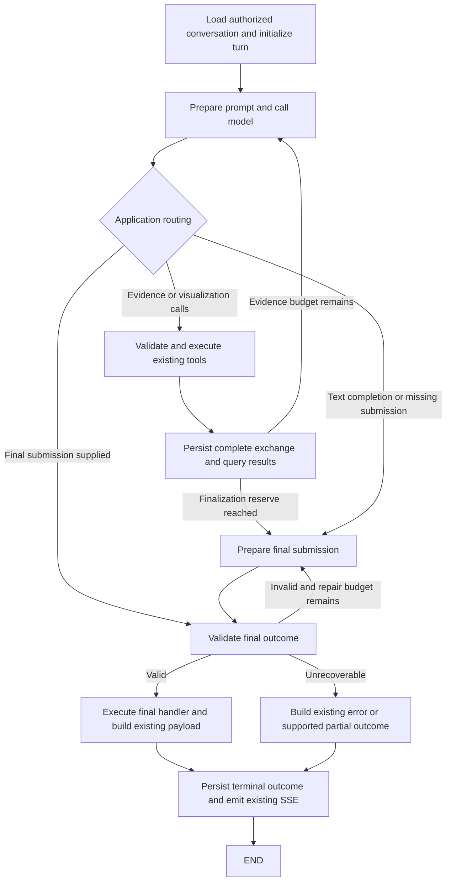

# Workbench LangGraph migration plan

## Objective and scope

Replace the Workbench agent's handwritten orchestration loop with a LangGraph `StateGraph`. Make final-answer handling an application-controlled step so that omitting `submit_final_answer` cannot silently finish a database-backed turn without its result rendering.

Preserve the existing tools, SQL generation and execution, source permissions, query attribution, charts, citations, follow-up questions, streaming, cancellation, compaction, and public API contracts. Continue using the current self-hosted LLM client and model.

Determinism means enforced transitions, bounded recovery, and validated terminal outcomes. It does not mean identical generated SQL or prose, or that an unavailable model can always produce a valid answer. Every connected request must end with a validated answer, clarification, refusal, or explicit error. Cancellation retains its existing partial-turn behavior.

## Findings from the current implementation

- `backend/app/services/workbench/graph.py` is currently the SSE and request lifecycle wrapper; it calls `agent.run()`, rather than executing a LangGraph graph.
- `agent.py::run()` allows a nonempty text response to end the loop. `_select()` accepts a `tool_choice` argument internally, but does not forward that argument to `client.complete()`. Prompt instructions therefore do not enforce final submission.
- `submit_final_answer` already has typed contracts in `agent_contracts.py` and an MCP implementation in `backend/app/mcp/workbench_server.py`. Database answers select one successful query and a view. Clarifications and refusals have separate contracts.
- Ordinary text, schema/conceptual answers, and external-source answers have existing rendering paths. They must remain supported; the database submission contract must not be imposed on them.
- `history.py` stores version 9 conversation events in PostgreSQL, including native tool exchanges and query registries. Its `_MEMORY` dictionary is primarily a fallback: reads normally query PostgreSQL, and persistence failures can currently be swallowed.
- `prompts.py` already caches the complete governed schema by catalog version and places it in a stable system prefix. Question-specific catalog hints follow the history.
- `slot_cache.py` supports conversation-specific llama.cpp save/restore. Snapshots default to disabled. The shared request gate serializes model access across cooperating API and MCP processes, but the current client does not explicitly send `cache_prompt` or `id_slot`.
- `compaction/request.py` already budgets context, preserves complete tool exchanges, and persists compacted request context. Full conversation events remain stored.
- Existing tests explicitly accept model-selected free-text completion and some budget-exhaustion fallbacks. Migration tests must distinguish the requested finalization correction from features that must remain identical.

## Architecture

Use the LangGraph Graph API directly with ordinary async node functions and typed state. Keep the current LLM client, prompt builders, MCP catalog, executor, and rendering helpers. Build the graph once during application startup.

The request wrapper continues to own cancellation, disconnect cleanup, and unexpected exceptions. Those paths finalize running queries and traces without routing cancelled work back to the model.

### State ownership

Graph state holds the turn identity, current native messages, query references, tool outcomes, pending calls, draft final submission, validation errors, counters, and terminal status. Reset turn-specific fields for each question. Load earlier messages and query references through the existing history APIs.

Runtime context holds the emitter, clients, catalog, authenticated identity, cancellation resources, and live deadline. Avoid placing queues, connections, callbacks, and lock objects in durable state. Use explicit state updates so graph execution does not depend on hidden mutations of a shared dictionary.

Keep the native message dictionaries and their tool-call IDs and provider fields intact. Do not introduce message conversion that changes the prompt, loses reasoning metadata, or duplicates exchanges.

### Mandatory finalization

1. All normal completion branches enter a final-outcome validator. No model-response node has a direct edge to successful `END`.
2. A valid model-emitted final submission proceeds directly to the existing final handler, without another model call.
3. If a database-backed response omits submission, the graph enters a dedicated finalization request using the string `tool_choice: "required"` and only the authorized `submit_final_answer` tool definition. Preserve earlier tool exchanges in history and reject other calls in this phase. The deployed llama.cpp server ignores named tool-choice objects.
4. Verify required tool calling with the deployed model and chat template. If it cannot enforce that mode reliably, evaluate validated structured output with the existing submission schema before rollout; do not add repeated speculative provider fallbacks to every request. The current client treats tools and JSON-schema mode as mutually exclusive.
5. The application invokes the same final-submission business handler after validating the generated arguments. Routing and invocation no longer depend on the model deciding to call the tool voluntarily. Record application-origin actions truthfully; do not fabricate assistant tool calls in native history.
6. Validate query existence, ownership, success, data availability, permissions, and view compatibility using current logic. Resolve prior-turn query IDs through the existing registry, including “show the previous result as a chart” without unnecessary SQL execution.
7. Keep plain-text and external-source outcomes on their existing answer path under the mandatory validator. Do not manufacture a database query ID for them.
8. Reserve model rounds, tool-call capacity, and deadline time for finalization and any permitted repair. Reuse the existing total limits and count every request, including compaction and recovery. LangGraph's recursion limit is an additional guard, not the turn budget.
9. When valid synthesis remains unavailable, preserve an existing evidence-based partial outcome only where current contracts support it. Otherwise emit an explicit error. Do not choose an arbitrary query, invent insights, or report success with missing result attribution.

Finalization must be idempotent by owner, conversation, and turn. An already recorded terminal result is reused instead of generating a second answer/card. Persist the terminal payload before emitting its authoritative event. Streaming draft text remains provisional until that event. Do not claim exactly-once delivery across network disconnects; conversation reload must recover the committed result.

## History and persistence

Keep `public.workbench_conversations` and its existing event format as the authoritative conversation store. Preserve all currently supported version 9 histories and their API representation; no history reset is needed.

For this migration, compile the graph without a separate LangGraph checkpointer. Existing PostgreSQL history already provides cross-turn memory, and automatic continuation of an interrupted turn is not a requested feature. Adding a second durable transcript would increase write volume and create two competing sources of truth. LangGraph checkpointers can be introduced separately if automatic node-level recovery becomes a requirement.

For each turn:

- Load history only after checking authenticated ownership and current source policy.
- Preserve the user question, assistant messages, complete tool-call/result pairs, query registry, final answer, usage, trace, and compaction context.
- Serialize writes to a conversation and use a revision check so two workers cannot overwrite each other's turns. The guard must work across deployed workers, not just within one event loop.
- Keep a bounded cache of deserialized records and derived replay messages. Key it by authenticated owner, conversation ID, persisted revision, and replay/compaction version. Add an internal revision column if necessary, without changing the public record format.
- Check the database revision before accepting cached content; invalidate or refresh on committed writes and compaction. Apply entry and byte limits so long chats cannot exhaust memory.
- Keep database failures distinct from cache misses. A failed history load must not silently start an empty conversation. A failed durable terminal write must not be reported as durably completed; surface the existing error mechanism. This reliability correction is necessary to meet the history-storage requirement.

Compaction changes only the context sent to the model. Reuse the existing stored summary, recent exchanges, query registry, and full saved history. Do not add routine summarization calls to short conversations. Verify follow-ups both before and after compaction; a lossy summary is not a promise of exact recall of every old sentence.

## Caching on low-end hardware

Treat these as distinct layers:

| Layer | Purpose | Planned handling |
| --- | --- | --- |
| Governed schema cache | Avoid rebuilding a large schema string | Preserve existing catalog-version cache and startup preparation |
| Conversation/replay cache | Avoid repeatedly loading and reconstructing history | Bounded, revision-aware cache over PostgreSQL history |
| LLM prompt/KV cache | Avoid re-evaluating repeated schema and history tokens | Stable rendered prompt prefixes, supported server cache settings, and verified conversation snapshots |

Python caching and LangGraph persistence do not themselves reduce LLM prefill work. The server must actually reuse model state.

### Stable model input

- Retain the complete governed schema; do not replace it with a smaller schema as part of this migration.
- Preserve a stable order: system instructions and schema, authorized tool definitions as rendered by the model template, retained conversation context, current question/hints, and current exchanges.
- Keep schema text, tool order, JSON serialization, and native replay stable when their meaning has not changed. Keep variable timestamps and trace IDs out of the shared prefix.
- Compare the provider's rendered/tokenized prompt across continuation requests and across turns. Current hint insertion, synthetic nudges, reasoning replay, and system-message coalescing can change the common prefix; verify actual reuse rather than inferring it from Python message order.
- Finalization offers only `submit_final_answer` to support llama.cpp's string tool-choice mode. Include the changed tool list in cache identities and measure KV-cache reuse when entering or leaving finalization, especially when the chat template puts tool definitions before the schema.
- Invalidate cache identities when catalog, prompt, tool policy/schema, model artifact, tokenizer/chat template, or context configuration changes. A stable model alias alone is insufficient to identify model compatibility.

### Slot reuse and snapshots

- Verify the exact llama-server build, model, template, context size, slot count, and supported request parameters.
- Explicitly configure prompt reuse and the intended slot where supported by that server. Preserve shared request serialization.
- Keep restore, completion, and save inside the same shared gate. Account for another conversation, a background feature, or a compaction request using the slot between graph nodes. A per-turn “initialized” flag is insufficient to establish current slot ownership.
- Use owner- and conversation-specific snapshots. Restore only compatible snapshots; on a missing or invalid snapshot, reconstruct from durable history and perform a cold request.
- Bound snapshot disk usage and memory use. Measure save/restore time and bytes before deciding save frequency; avoid unnecessary restore when the correct compatible slot is still resident.
- Do not enable snapshots solely because save/restore endpoints return success. Require cached-token and prefill evidence on an A → B → A conversation-switch test and a server-restart test.
- If the deployed model/server cannot reuse restored conversation state, record the unmet cache gate and resolve deployment compatibility before rollout. LangGraph cannot supply missing KV-cache support.

Do not add generic caching to database query or answer nodes: that could serve stale financial data. Reusing a specifically referenced prior result retains the existing conversation behavior; requests for fresh data continue executing through existing tools.

## Sequential implementation plan

Complete and verify each step before beginning the next.

| Step | Changes | Verification gate |
| --- | --- | --- |
| 1. Capture baseline | Record current SSE/API payloads, feature scenarios, history replay, model-call counts, and cold/warm timings. Reproduce a query followed by text without submission. Probe forced finalization and slot reuse on the deployed server. | Failure reproduction and provider capability results recorded; supported final-output mode selected. |
| 2. Introduce graph | Add compatible pinned LangGraph dependency to `pyproject.toml`, `requirements.txt`, and lockfile. Add a typed workflow module and replace the previous orchestration loop. Reuse existing helpers and make LangGraph the only execution path. | Existing behavior scenarios pass through graph nodes, including cancellation and multi-tool exchanges. |
| 3. Enforce finalization | Add mandatory validation, dedicated finalization, bounded repair, budget reserves, and idempotent terminal handling. Make the shared final handler callable without pretending the model emitted a tool call. | Missing submission, invalid query/view, exhausted budget, and valid direct submission all produce the specified terminal behavior. |
| 4. Verify durable history | Preserve version 9 replay; add required write acknowledgement, conversation concurrency protection, and bounded revision-aware replay caching. | Restart/reload, cross-worker access, cache eviction, database outage, prior-query reuse, and no cross-user history leakage. |
| 5. Verify inference caching | Preserve stable prefixes; make server-specific cache/slot configuration explicit; validate ownership, invalidation, and snapshot lifecycle. | Real schema and history cache hits on the target hardware, including interleaved conversations and compaction. |
| 6. Prove feature parity | Run existing relevant backend/frontend tests and representative live conversations. Add only critical missing regressions. | No unintended changes to tools, permissions, query/chart behavior, citations, streaming, or cancellation. |
| 7. Roll out | Verify the graph in staging, inspect terminal errors and latency, then deploy. Retain the previous application release for deployment rollback. | Gates below met; existing conversations work after upgrading. |

Use deterministic recorded or scripted model/tool outputs to compare the graph with recorded baseline behavior.

## Files expected to change

- New `backend/app/services/workbench/workflow.py`: graph state, nodes, and conditional transitions.
- `agent.py`: retain reusable selection/execution helpers and budget logic; migrate orchestration only.
- `graph.py`: invoke the compiled workflow while preserving request/SSE lifecycle.
- `agent_executor.py`, `agent_contracts.py`, and `mcp/workbench_server.py`: minimal shared finalization integration if needed; preserve public tool schemas.
- `history.py`: acknowledgement, idempotency, revision/concurrency handling, and bounded replay caching.
- `prompts.py`, `compaction/request.py`, `nlq/llm/client.py`, and `slot_cache.py`: only changes required for enforced final output, correct budgets, and verified cache reuse.
- `core/config.py` and application startup: graph lifecycle; cache settings only where needed.
- Dependency files, focused existing tests, and rollout documentation.

Frontend implementation changes are not expected because current SSE and rendering contracts remain intact. Existing frontend tests and browser smoke checks still form part of acceptance.

## Acceptance gates

**Finalization:** Every scripted successful path reaches final validation. A database result followed by plain prose cannot silently complete without a valid rendered result or explicit error. Invalid final arguments cannot trigger rendering. Valid existing submissions incur no additional model call. Repair and evidence loops remain within configured budgets.

**Feature parity:** Exercise database answers, multi-query discovery and correction, prior-query chart changes, conceptual answers, all enabled curated/public sources, mixed evidence, clarification, refusal, empty results, partial failures, citations, source toggles, private-data restrictions, cancellation, and history reload. Preserve the existing single-selected-query final-answer contract.

**History:** Follow-up questions work after page reload and backend restart. Complete native exchanges remain replayable. Cache eviction changes performance only. Concurrent updates do not lose turns. Full saved history remains available after compaction.

**Performance:** Measure cold first turn, warm continuation, same-chat follow-up, A → B → A switching, post-compaction requests, and invalidation after a schema/model/template change. Record cached/uncached prompt tokens, prefill and first-token latency, total latency, LLM request count, snapshot time/size, and application memory. Require demonstrated reuse of the unchanged schema and eligible history prefix. Establish numerical latency/memory limits from the real baseline before rollout; do not promise an unsupported fixed speedup.

**Verification:** Run targeted critical regressions while implementing, then the relevant Workbench/NLQ suite, frontend `npm test`, browser rendering checks, and the repository-required backend `ruff check` and `ty check`. Record pre-existing failures separately and introduce no new diagnostics in changed code.

**Rollback:** Redeploy the previous application release for missing terminal results, corrupted replay, feature regressions, or sustained cache/latency regressions. Keep history format and additive database changes compatible with the previous release. Cache invalidation on rollback may cause cold requests but must not lose history.

## Documentation references

- [LangGraph Graph API](https://docs.langchain.com/oss/python/langgraph/graph-api): explicit nodes, state, and conditional routing.
- [LangGraph persistence](https://docs.langchain.com/oss/python/langgraph/persistence): graph checkpointing is optional infrastructure distinct from application conversation storage and inference caching.
- [llama.cpp server documentation](https://github.com/ggml-org/llama.cpp/blob/master/tools/server/README.md): prompt reuse, slot selection, and snapshot endpoints; deployed-version compatibility must be measured.

## Planning verification

No application code was changed while preparing this plan. Backend `ruff check` reported 10 existing errors. `ty check`, invoked from the backend directory, reported 408 existing diagnostics, including import-resolution issues and diagnostics elsewhere in the discovered project. These are a baseline, not successful checks.

The focused baseline run covering `test_agent.py`, `test_history.py`, `test_prompts.py`, and `test_slot_cache.py` finished with 81 passed and 1 failed. The existing failure is `test_answer_prompts_do_not_duplicate_structured_result_rows`, which expects wording absent from the current system prompt. Live server capability and cache benchmarks remain implementation prerequisites; they were not run during planning.
